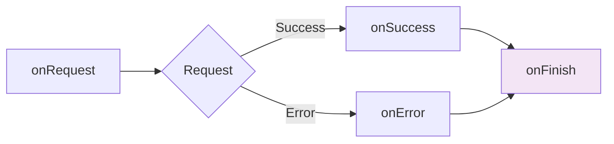

# onFinish Callback

The `onFinish` callback is called **always** after a request completes, regardless of success or failure.

## Signature

```typescript
onFinish?: () => void | Promise<void>
```

The callback receives **no parameters** - it's purely for cleanup and side effects.

## Basic Usage

```typescript
useFetchGetPets({}, {
  onFinish: () => {
    console.log('Request complete')
  }
})
```

## When It Runs

`onFinish` **always runs**:

- ✅ After successful request (2xx)
- ✅ After failed request (4xx/5xx)
- ✅ After network error
- ✅ After request cancellation

It runs **last** in the callback chain:



## Common Use Cases

### Hide Loading Spinner

```vue
<script setup lang="ts">
const loading = ref(false)

const { data: pets } = useFetchGetPets({}, {
  onRequest: () => {
    loading.value = true
  },
  onFinish: () => {
    loading.value = false
  }
})
</script>

<template>
  <div v-if="loading" class="spinner">Loading...</div>
  <ul v-else>
    <li v-for="pet in pets" :key="pet.id">{{ pet.name }}</li>
  </ul>
</template>
```

### Track Request Completion

```typescript
useFetchGetPets({}, {
  onFinish: () => {
    trackEvent('api_request_complete', {
      timestamp: Date.now()
    })
  }
})
```

### Cleanup Operations

```typescript
let controller: AbortController | null = null

useFetchGetPets({}, {
  onRequest: () => {
    controller = new AbortController()
  },
  onFinish: () => {
    // cleanup the controller
    controller = null
  }
})
```

### Reset UI State

```vue
<script setup lang="ts">
const isSubmitting = ref(false)
const showSuccessBanner = ref(false)

const { execute: submit } = useFetchCreatePet(
  { body: formData.value },
  {
    immediate: false,
    onRequest: () => {
      isSubmitting.value = true
      showSuccessBanner.value = false
    },
    onSuccess: () => {
      showSuccessBanner.value = true
    },
    onFinish: () => {
      isSubmitting.value = false
    }
  }
)
</script>

<template>
  <button @click="submit" :disabled="isSubmitting">
    {{ isSubmitting ? 'Submitting...' : 'Submit' }}
  </button>
  <div v-if="showSuccessBanner">Success!</div>
</template>
```

### Measure Request Duration

```typescript
const startTime = ref(0)

useFetchGetPets({}, {
  onRequest: () => {
    startTime.value = performance.now()
  },
  onFinish: () => {
    const duration = performance.now() - startTime.value
    console.log(`Request took ${duration.toFixed(2)}ms`)
    
    // Track slow requests
    if (duration > 1000) {
      trackEvent('slow_request', {
        duration,
        url: '/api/pets'
      })
    }
  }
})
```

### Log Request Completion

```typescript
useFetchGetPets({}, {
  onRequest: ({ url, method }) => {
    console.log(`[API] ${method} ${url} - Started`)
  },
  onSuccess: (data) => {
    console.log(`[API] Success - ${data.length} items`)
  },
  onError: (error) => {
    console.error(`[API] Error - ${error.status}`)
  },
  onFinish: () => {
    console.log('[API] Request finished')
  }
})
```

## Async Operations

The callback can be async:

```typescript
useFetchGetPets({}, {
  onFinish: async () => {
    // Send timing to analytics
    await trackTiming('api_request_complete', duration)
  }
})
```

## No Access to Data or Error

`onFinish` runs for both success and error cases, so it **cannot access**:

- ❌ Response data (use `onSuccess`)
- ❌ Error details (use `onError`)

```typescript
// ❌ Wrong - no parameters
onFinish: (data) => {  // No 'data' parameter!
  console.log(data)
}

// ✅ Correct - no parameters
onFinish: () => {
  console.log('Done')
}
```

## Order of Execution

```typescript
useFetchGetPets({}, {
  onRequest: () => {
    console.log('1. onRequest')
  },
  onSuccess: () => {
    console.log('2. onSuccess (or onError)')
  },
  onFinish: () => {
    console.log('3. onFinish (always last)')
  }
})

// Output (success):
// 1. onRequest
// 2. onSuccess
// 3. onFinish

// Output (error):
// 1. onRequest
// 2. onError
// 3. onFinish
```

## Complex Examples

### Complete Loading State

```vue
<script setup lang="ts">
const state = ref<'idle' | 'loading' | 'success' | 'error'>('idle')

const { execute: loadPets, data, error } = useFetchGetPets({}, {
  immediate: false,
  onRequest: () => {
    state.value = 'loading'
  },
  onSuccess: () => {
    state.value = 'success'
  },
  onError: () => {
    state.value = 'error'
  },
  onFinish: () => {
    // Could add additional logic here that runs regardless
    console.log('Request complete, state:', state.value)
  }
})
</script>

<template>
  <div>
    <button @click="loadPets" :disabled="state === 'loading'">
      Load Pets
    </button>
    
    <div v-if="state === 'loading'">Loading...</div>
    <div v-else-if="state === 'success'">
      <ul>
        <li v-for="pet in data" :key="pet.id">{{ pet.name }}</li>
      </ul>
    </div>
    <div v-else-if="state === 'error'">
      Error: {{ error?.message }}
    </div>
  </div>
</template>
```

### Request Queue Management

```vue
<script setup lang="ts">
const activeRequests = ref(0)

const incrementRequests = () => {
  activeRequests.value++
}

const decrementRequests = () => {
  activeRequests.value--
}

const { data: pets } = useFetchGetPets({}, {
  onRequest: incrementRequests,
  onFinish: decrementRequests
})

const { data: owners } = useFetchGetOwners({}, {
  onRequest: incrementRequests,
  onFinish: decrementRequests
})

const isAnyLoading = computed(() => activeRequests.value > 0)
</script>

<template>
  <div v-if="isAnyLoading" class="global-loader">
    Loading... ({{ activeRequests }} requests)
  </div>
</template>
```

### Timing and Analytics

```vue
<script setup lang="ts">
interface RequestMetrics {
  url: string
  startTime: number
  endTime?: number
  duration?: number
  success: boolean
}

const metrics = ref<RequestMetrics>({
  url: '',
  startTime: 0,
  success: false
})

useFetchGetPets({}, {
  onRequest: ({ url }) => {
    metrics.value = {
      url,
      startTime: performance.now(),
      success: false
    }
  },
  onSuccess: () => {
    metrics.value.success = true
  },
  onFinish: async () => {
    metrics.value.endTime = performance.now()
    metrics.value.duration = metrics.value.endTime - metrics.value.startTime
    
    // Send metrics to analytics
    await trackEvent('api_request_complete', {
      url: metrics.value.url,
      duration: metrics.value.duration,
      success: metrics.value.success
    })
    
    console.log('Request metrics:', metrics.value)
  }
})
</script>
```

## Best Practices

### ✅ Do

```typescript
// ✅ Hide loading indicators
onFinish: () => {
  loading.value = false
}

// ✅ Cleanup resources
onFinish: () => {
  abortController = null
}

// ✅ Track completion
onFinish: () => {
  trackEvent('request_complete')
}

// ✅ Reset UI state
onFinish: () => {
  isSubmitting.value = false
}
```

### ❌ Don't

```typescript
// ❌ Don't try to access data
onFinish: (data) => {  // No parameters!
  console.log(data)
}

// ❌ Don't handle success/error logic
onFinish: () => {
  if (success) {  // Use onSuccess/onError instead
    showToast('Success')
  }
}

// ❌ Don't make assumptions about state
onFinish: () => {
  // Don't assume success or error
  // Use onSuccess/onError for that
}
```

## Global vs Local Finish Callbacks

### Global (runs for all requests)

```typescript
// plugins/api.ts
const activeRequests = ref(0)

useGlobalCallbacks({
  onRequest: () => {
    activeRequests.value++
  },
  onFinish: () => {
   activeRequests.value--
  }
})
```

### Local (runs for specific request)

```typescript
useFetchGetPets({}, {
  onFinish: () => {
    console.log('This specific request is done')
  }
})
```

Both callbacks run (global first, then local).

## Use Cases Summary

| Use Case | Example |
|----------|---------|
| **Hide Loading** | `loading.value = false` |
| **Cleanup** | `abortController = null` |
| **Track Timing** | `console.log(performance.now() - startTime)` |
| **Track Analytics** | `trackEvent('request_complete')` |
| **Reset State** | `isSubmitting.value = false` |
| **Log Completion** | `console.log('Request done')` |

## Next Steps

- [Callbacks Overview →](/composables/features/callbacks/overview)
- [Global Callbacks →](/composables/features/global-callbacks/overview)
- [Practical Examples →](/examples/composables/callbacks/error-toast.md)
