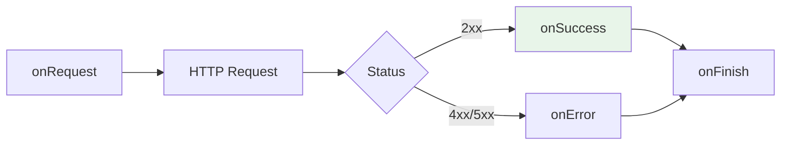

# onSuccess Callback

The `onSuccess` callback is called when the HTTP request completes with a **2xx status code** (200-299).

## Signature

```typescript
onSuccess?: (data: T) => void | Promise<void>
```

The `data` parameter is **fully typed** based on your OpenAPI schema.

## Basic Usage

```typescript
useFetchGetPetById(
  { petId: 123 },
  {
    onSuccess: (pet) => {
      // pet is typed as Pet from OpenAPI
      console.log('Loaded pet:', pet.name)
    }
  }
)
```

## Common Use Cases

### Show Success Message

```typescript
useFetchCreatePet(
  { body: formData.value },
  {
    onSuccess: (pet) => {
      showToast(`Pet created: ${pet.name}`, 'success')
    }
  }
)
```

### Navigate After Success

```typescript
useFetchCreatePet(
  { body: formData.value },
  {
    onSuccess: (pet) => {
      navigateTo(`/pets/${pet.id}`)
    }
  }
)
```

### Update Global State

```typescript
const petsStore = usePetsStore()

useFetchCreatePet(
  { body: formData.value },
  {
    onSuccess: (pet) => {
      // Add to Pinia store
      petsStore.addPet(pet)
    }
  }
)
```

### Reset Form

```vue
<script setup lang="ts">
const form = ref({
  name: '',
  status: 'available'
})

const { execute: submit } = useFetchCreatePet(
  { body: form.value },
  {
    immediate: false,
    onSuccess: (pet) => {
      showToast(`Created: ${pet.name}`, 'success')
      // Reset form
      form.value = { name: '', status: 'available' }
    }
  }
)
</script>
```

### Refresh Related Data

```vue
<script setup lang="ts">
const { data: pets, refresh: refreshPets } = useFetchGetPets()

const { execute: deletePet } = useFetchDeletePet(
  { petId: 123 },
  {
    immediate: false,
    onSuccess: () => {
      showToast('Pet deleted', 'success')
      // Refresh pet list
      refreshPets()
    }
  }
)
</script>
```

### Track Analytics

```typescript
useFetchGetPets({}, {
  onSuccess: (pets) => {
    trackEvent('pets_loaded', {
      count: pets.length,
      timestamp: Date.now()
    })
  }
})
```

### Cache Data Locally

```typescript
useFetchGetPets({}, {
  onSuccess: (pets) => {
    // Store in localStorage
    localStorage.setItem('cached-pets', JSON.stringify(pets))
  }
})
```

### Update UI State

```vue
<script setup lang="ts">
const showSuccessBanner = ref(false)

useFetchCreatePet(
  { body: formData.value },
  {
    onSuccess: (pet) => {
      showSuccessBanner.value = true
      
      // Hide after 3 seconds
      setTimeout(() => {
        showSuccessBanner.value = false
      }, 3000)
    }
  }
)
</script>

<template>
  <div v-if="showSuccessBanner" class="success-banner">
    Pet created successfully!
  </div>
</template>
```

## Async Operations

The callback can be async:

```typescript
useFetchCreatePet(
  { body: formData.value },
  {
    onSuccess: async (pet) => {
      // Wait for analytics
      await trackEvent('pet_created', { id: pet.id })
      
      // Then navigate
      navigateTo(`/pets/${pet.id}`)
    }
  }
)
```

## Type Safety

The data parameter is **fully typed** from your OpenAPI schema:

```typescript
useFetchGetPetById(
  { petId: 123 },
  {
    onSuccess: (pet) => {
      // TypeScript knows Pet structure
      pet.id        // ✅ number
      pet.name      // ✅ string
      pet.status    // ✅ 'available' | 'pending' | 'sold'
      pet.unknown   // ❌ Type error
    }
  }
)
```

## When It Runs

`onSuccess` **only runs** when:

- ✅ Response status is **2xx** (200, 201, 204, etc.)
- ✅ Request completed successfully

`onSuccess` **does not run** when:

- ❌ Response status is **4xx** or **5xx** (use `onError`)
- ❌ Network error occurred (use `onError`)
- ❌ Request was cancelled

## Execution Order



## Complex Examples

### Multi-Step Success Flow

```typescript
useFetchCreateOrder(
  { body: orderData.value },
  {
    onSuccess: async (order) => {
      // 1. Show success message
      showToast('Order created!', 'success')
      
      // 2. Track analytics
      await trackEvent('order_created', {
        orderId: order.id,
        total: order.total
      })
      
      // 3. Update cart
      const cartStore = useCartStore()
      cartStore.clearCart()
      
      // 4. Navigate to confirmation
      navigateTo(`/orders/${order.id}/confirmation`)
    }
  }
)
```

### Conditional Actions

```typescript
useFetchUpdatePet(
  { petId: 123, body: updates.value },
  {
    onSuccess: (pet) => {
      showToast('Pet updated!', 'success')
      
      // Only navigate if status changed
      if (pet.status === 'sold') {
        navigateTo('/pets/sold')
      }
      
      // Only notify if name changed
      if (pet.name !== previousName.value) {
        notifyNameChange(pet.name)
      }
    }
  }
)
```

### Transform and Store

```typescript
const petsStore = usePetsStore()

useFetchGetPets({}, {
  onSuccess: (pets) => {
    // Transform data
    const enrichedPets = pets.map(pet => ({
      ...pet,
      displayName: `${pet.name} (#${pet.id})`,
      isAvailable: pet.status === 'available'
    }))
    
    // Store transformed data
    petsStore.setPets(enrichedPets)
  }
})
```

## Best Practices

### ✅ Do

```typescript
// ✅ Show user feedback
onSuccess: (data) => {
  showToast('Success!', 'success')
}

// ✅ Navigate after action
onSuccess: (pet) => {
  navigateTo(`/pets/${pet.id}`)
}

// ✅ Update state
onSuccess: (data) => {
  store.updateData(data)
}

// ✅ Track analytics
onSuccess: async (data) => {
  await trackEvent('success', { id: data.id })
}
```

### ❌ Don't

```typescript
// ❌ Don't make other API calls (use watch instead)
onSuccess: async (pet) => {
  await $fetch(`/api/owners/${pet.ownerId}`) // Can cause issues
}

// ❌ Don't modify the data parameter
onSuccess: (data) => {
  data.extra = 'field' // Mutating response
}

// ❌ Don't rely on success for error handling
onSuccess: (data) => {
  if (data.error) { // Use onError instead
    handleError(data.error)
  }
}
```

## Integration with Reactive State

```vue
<script setup lang="ts">
const pets = ref<Pet[]>([])
const loading = ref(false)

useFetchGetPets({}, {
  onRequest: () => {
    loading.value = true
  },
  onSuccess: (data) => {
    pets.value = data
  },
  onFinish: () => {
    loading.value = false
  }
})
</script>

<template>
  <div v-if="loading">Loading...</div>
  <ul v-else>
    <li v-for="pet in pets" :key="pet.id">{{ pet.name }}</li>
  </ul>
</template>
```

## Global vs Local Success Callbacks

### Global (runs for all requests)

```typescript
// plugins/api.ts
useGlobalCallbacks({
  onSuccess: (data) => {
    // Log all successful requests
    console.log('[API] Success:', data)
  }
})
```

### Local (runs for specific request)

```typescript
useFetchGetPets({}, {
  onSuccess: (pets) => {
    // Only for this request
    showToast(`Loaded ${pets.length} pets`, 'success')
  }
})
```

Both callbacks run (global first, then local).

## Next Steps

- [onError Callback →](/composables/features/callbacks/on-error)
- [onFinish Callback →](/composables/features/callbacks/on-finish)
- [Global Callbacks →](/composables/features/global-callbacks/overview)
