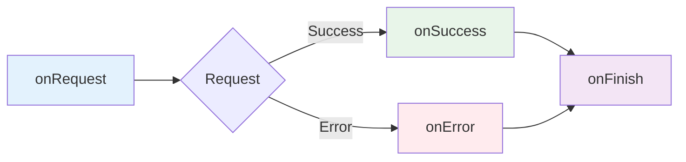

# Callbacks Overview

Callbacks let you execute code at different stages of the API request lifecycle. Every generated composable supports four lifecycle callbacks.

## The Four Callbacks



### Execution Order

1. **`onRequest`** - Before request is sent
2. **Request executes** - HTTP call to API
3. **`onSuccess`** OR **`onError`** - Based on response
4. **`onFinish`** - Always runs (cleanup)

## Quick Example

```typescript
useFetchGetPetById(
  { petId: 123 },
  {
    onRequest: ({ url }) => {
      console.log('⏱️ Fetching from:', url)
    },
    onSuccess: (pet) => {
      console.log('✅ Loaded:', pet.name)
    },
    onError: (error) => {
      console.error('❌ Failed:', error.message)
    },
    onFinish: () => {
      console.log('🏁 Request complete')
    }
  }
)
```

## Callback Types

### onRequest

Called **before** the request is sent.

**Use for:**
- Adding custom headers
- Logging requests
- Showing loading UI
- Modifying request parameters

[Learn more about onRequest →](/composables/features/callbacks/on-request)

### onSuccess

Called when response status is **2xx** (success).

**Use for:**
- Showing success messages
- Navigation after successful action
- Updating global state
- Analytics tracking

[Learn more about onSuccess →](/composables/features/callbacks/on-success)

### onError

Called when response status is **4xx/5xx** or network error.

**Use for:**
- Showing error messages
- Retrying requests
- Logging errors
- Redirecting to login (401)

[Learn more about onError →](/composables/features/callbacks/on-error)

### onFinish

Called **always** after request completes (success or error).

**Use for:**
- Hiding loading spinners
- Cleanup operations
- Analytics tracking
- Resetting UI state

[Learn more about onFinish →](/composables/features/callbacks/on-finish)

## Common Patterns

### Loading State

```vue
<script setup lang="ts">
const loading = ref(false)

const { data: pet } = useFetchGetPetById(
  { petId: 123 },
  {
    onRequest: () => {
      loading.value = true
    },
    onFinish: () => {
      loading.value = false
    }
  }
)
</script>

<template>
  <div v-if="loading">Loading...</div>
  <div v-else>{{ pet?.name }}</div>
</template>
```

### Success Toast

```typescript
useFetchCreatePet(
  { body: formData.value },
  {
    onSuccess: (pet) => {
      showToast(`Created pet: ${pet.name}`, 'success')
      navigateTo(`/pets/${pet.id}`)
    }
  }
)
```

### Error Handling

```typescript
useFetchGetPets({}, {
  onError: (error) => {
    if (error.status === 401) {
      navigateTo('/login')
    } else if (error.status === 404) {
      showToast('Pets not found', 'error')
    } else {
      showToast('Failed to load pets', 'error')
    }
  }
})
```

### Request Logging

```typescript
useFetchGetUsers({}, {
  onRequest: ({ url, method }) => {
    console.log(`[API] ${method} ${url}`)
  },
  onSuccess: (data) => {
    console.log('[API] Success:', data)
  },
  onError: (error) => {
    console.error('[API] Error:', error)
  }
})
```

## Local vs Global Callbacks

### Local Callbacks

Defined per composable call:

```typescript
useFetchGetPets({}, {
  onSuccess: (pets) => {
    console.log('Loaded pets:', pets.length)
  }
})
```

Applied **only to this request**.

### Global Callbacks

Defined once in a plugin:

```typescript
// plugins/api.ts
useGlobalCallbacks({
  onRequest: ({ headers }) => {
    headers['Authorization'] = `Bearer ${token}`
  }
})
```

Applied **to all requests** automatically.

[Learn more about global callbacks →](/composables/features/global-callbacks/overview)

## Async Callbacks

Callbacks can be async:

```typescript
useFetchGetPets({}, {
  onRequest: async ({ headers }) => {
    // Wait for token refresh
    const token = await refreshToken()
    headers['Authorization'] = `Bearer ${token}`
  },
  onSuccess: async (pets) => {
    // Wait for analytics
    await trackEvent('pets_loaded', { count: pets.length })
  }
})
```

## Callback Context

Each callback receives specific context:

### onRequest Context

```typescript
interface OnRequestContext {
  url: string
  method: string
  headers: Record<string, string>
  body?: any
  query: Record<string, any>
}
```

### onSuccess Context

```typescript
// Just the response data (fully typed)
type OnSuccessContext<T> = T
```

### onError Context

```typescript
interface ApiError extends Error {
  status: number
  statusText: string
  data: any
  url: string
}
```

### onFinish Context

```typescript
// No context (void)
```

## Error Propagation

Callbacks **don't stop** error propagation:

```vue
<script setup lang="ts">
const { data, error } = useFetchGetPets({}, {
  onError: (err) => {
    // This runs...
    console.error('Callback error:', err)
  }
})

// ...and error is still set
watch(error, (err) => {
  // This also runs
  if (err) {
    console.error('Watch error:', err)
  }
})
</script>
```

Both `onError` and `watch(error)` execute - callbacks are **additive**.

## Execution Guarantees

### onRequest

- ✅ Always runs before HTTP request
- ✅ Can modify request (headers, body, query)
- ❌ Cannot cancel request (use abort controller instead)

### onSuccess

- ✅ Only runs on 2xx status codes
- ✅ Data is typed from OpenAPI schema
- ❌ Doesn't run on errors

### onError

- ✅ Runs on 4xx/5xx status codes
- ✅ Runs on network errors
- ❌ Doesn't run on success

### onFinish

- ✅ **Always** runs (success or error)
- ✅ Guaranteed cleanup
- ⚠️ No access to data or error

## Next Steps

Learn about each callback in detail:

- [onRequest →](/composables/features/callbacks/on-request)
- [onSuccess →](/composables/features/callbacks/on-success)
- [onError →](/composables/features/callbacks/on-error)
- [onFinish →](/composables/features/callbacks/on-finish)
- [Global Callbacks →](/composables/features/global-callbacks/overview)
