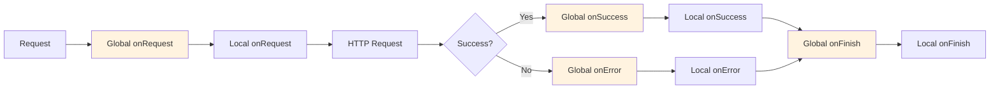

# Global Callbacks Overview

Global callbacks let you define callback logic **once** in a plugin and automatically apply it to **all API requests** in your application.

## Why Global Callbacks?

Instead of adding the same callbacks to every composable:

```typescript
// ❌ Repetitive - auth token in every request
useFetchGetPets({}, {
  onRequest: ({ headers }) => {
    headers['Authorization'] = `Bearer ${getToken()}`
  }
})

useFetchGetOwners({}, {
  onRequest: ({ headers }) => {
    headers['Authorization'] = `Bearer ${getToken()}`  // Repeated!
  }
})

useFetchGetAppointments({}, {
  onRequest: ({ headers }) => {
    headers['Authorization'] = `Bearer ${getToken()}`  // Repeated!
  }
})
```

Define once, apply everywhere:

```typescript
// ✅ Define once in plugin
useGlobalCallbacks({
  onRequest: ({ headers }) => {
    headers['Authorization'] = `Bearer ${getToken()}`
  }
})

// ✅ All requests automatically include auth token
useFetchGetPets({})
useFetchGetOwners({})
useFetchGetAppointments({})
```

## Setup

Create a plugin to register global callbacks:

```typescript
// plugins/api-global-callbacks.ts
export default defineNuxtPlugin(() => {
  useGlobalCallbacks({
    onRequest: ({ headers }) => {
      // Runs for ALL requests
      const token = useCookie('auth-token').value
      if (token) {
        headers['Authorization'] = `Bearer ${token}`
      }
    },
    onError: (error) => {
      // Runs for ALL errors
      if (error.status === 401) {
        navigateTo('/login')
      }
    }
  })
})
```

[Learn more about setup →](/composables/features/global-callbacks/setup)

## All Four Callbacks

Global callbacks support the same four lifecycle callbacks:

```typescript
useGlobalCallbacks({
  onRequest: ({ url, headers, body, query }) => {
    // Before every request
  },
  onSuccess: (data) => {
    // After every successful request
  },
  onError: (error) => {
    // After every failed request
  },
  onFinish: () => {
    // After every request (success or failure)
  }
})
```

## Common Use Cases

### Authentication

Add auth token to all requests:

```typescript
useGlobalCallbacks({
  onRequest: ({ headers }) => {
    const token = useCookie('auth-token').value
    if (token) {
      headers['Authorization'] = `Bearer ${token}`
    }
  },
  onError: (error) => {
    if (error.status === 401) {
      useCookie('auth-token').value = null
      navigateTo('/login')
    }
  }
})
```

### Error Handling

Centralized error handling:

```typescript
useGlobalCallbacks({
  onError: (error) => {
    console.error('[API Error]', error)
    
    if (error.status === 404) {
      showToast('Resource not found', 'error')
    } else if (error.status >= 500) {
      showToast('Server error, please try again', 'error')
    }
  }
})
```

### Request Logging

Log all API requests:

```typescript
useGlobalCallbacks({
  onRequest: ({ url, method }) => {
    console.log(`[API] ${method} ${url}`)
  },
  onSuccess: (data) => {
    console.log('[API] Success:', data)
  },
  onError: (error) => {
    console.error('[API] Error:', error.status)
  }
})
```

### Analytics Tracking

Track all API usage:

```typescript
useGlobalCallbacks({
  onRequest: ({ url, method }) => {
    trackEvent('api_request', { url, method })
  },
  onSuccess: (data) => {
    trackEvent('api_success')
  },
  onError: (error) => {
    trackEvent('api_error', { status: error.status })
  }
})
```

## Execution Order

Global callbacks run **before** local callbacks:

```typescript
// Plugin
useGlobalCallbacks({
  onRequest: () => console.log('1. Global onRequest')
})

// Component
useFetchGetPets({}, {
  onRequest: () => console.log('2. Local onRequest')
})

// Output:
// 1. Global onRequest
// 2. Local onRequest
```



## Control Options

You can control which requests global callbacks apply to:

### Skip Global Callbacks

```typescript
// Skip ALL global callbacks for this request
useFetchGetPublicPets({}, {
  skipGlobalCallbacks: true
})
```

### Skip by URL Pattern

```typescript
// Skip global callbacks for specific URLs
useFetchGetPublicPets({}, {
  skipForUrls: ['/api/public/*', '/api/health']
})
```

[Learn more about control options →](/composables/features/global-callbacks/control-options)

## URL Patterns

Filter which callbacks run based on URL patterns:

```typescript
useGlobalCallbacks({
  onRequest: ({ url, headers }) => {
    // Only add auth to /api/private/* endpoints
    if (url.startsWith('/api/private')) {
      headers['Authorization'] = `Bearer ${getToken()}`
    }
  }
})
```

[Learn more about URL patterns →](/composables/features/global-callbacks/patterns)

## Real-World Example

Complete plugin with auth, errors, and logging:

```typescript
// plugins/api-global-callbacks.ts
export default defineNuxtPlugin(() => {
  const authStore = useAuthStore()
  
  useGlobalCallbacks({
    onRequest: ({ url, method, headers }) => {
      // 1. Add auth token
      if (authStore.token) {
        headers['Authorization'] = `Bearer ${authStore.token}`
      }
      
      // 2. Add request ID for tracing
      headers['X-Request-ID'] = crypto.randomUUID()
      
      // 3. Log request (dev only)
      if (process.env.NODE_ENV === 'development') {
        console.log(`[API] ${method} ${url}`)
      }
    },
    
    onSuccess: (data) => {
      // Log success (dev only)
      if (process.env.NODE_ENV === 'development') {
        console.log('[API] Success')
      }
    },
    
    onError: (error) => {
      // 1. Log error
      console.error('[API Error]', {
        url: error.url,
        status: error.status,
        message: error.message
      })
      
      // 2. Handle auth errors
      if (error.status === 401) {
        authStore.logout()
        navigateTo('/login')
        return
      }
      
      // 3. Show user-friendly errors
      if (error.status === 403) {
        showToast('Access denied', 'error')
      } else if (error.status >= 500) {
        showToast('Server error, please try again', 'error')
      }
    },
    
    onFinish: () => {
      // Track request completion
      if (process.env.NODE_ENV === 'development') {
        console.log('[API] Request complete')
      }
    }
  })
})
```

## Benefits

### ✅ DRY (Don't Repeat Yourself)

- Define logic once, apply everywhere
- No need to repeat auth token in every request
- Centralized error handling

### ✅ Consistent Behavior

- All requests follow the same patterns
- Easier to maintain and update
- Less chance of forgetting to add auth token

### ✅ Separation of Concerns

- API logic stays in plugin
- Components focus on UI logic
- Clear separation between global and local concerns

## When to Use

### ✅ Use Global Callbacks For:

- **Authentication**: Add tokens to all requests
- **Error Handling**: Handle 401/403/500 errors globally
- **Logging**: Log all API requests
- **Analytics**: Track all API usage
- **Request IDs**: Add correlation IDs to all requests

### ❌ Don't Use Global Callbacks For:

- **Request-specific logic**: Use local callbacks
- **UI updates**: Should be in components
- **Complex transformations**: Use local callbacks
- **One-off behavior**: Use local callbacks

## Next Steps

- [Setup Guide →](/composables/features/global-callbacks/setup)
- [Control Options →](/composables/features/global-callbacks/control-options)
- [URL Patterns →](/composables/features/global-callbacks/patterns)
- [Examples →](/examples/composables/global-callbacks/auth-token)
