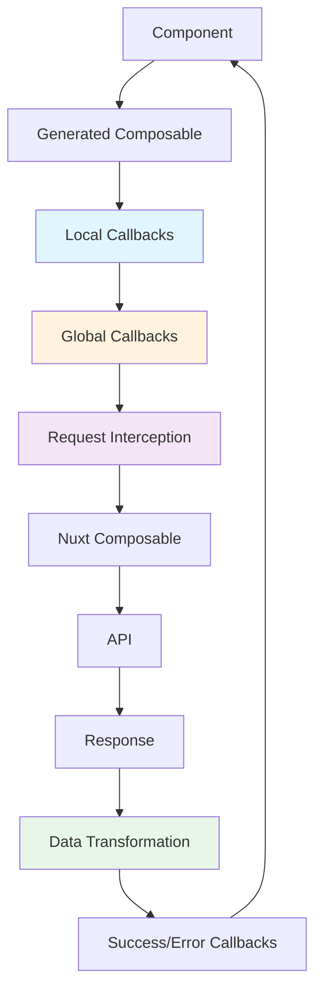

# Shared Features

Both `useFetch` and `useAsyncData` composables share powerful features that enhance your API integration.

## Overview

Generated composables include:

- ✅ **Lifecycle Callbacks**: Execute code at different request stages
- ✅ **Global Callbacks**: Define callbacks once, apply everywhere
- ✅ **Request Interception**: Modify requests before sending
- ✅ **Data Transformation**: Transform response data with `transform` and `pick`
- ✅ **Authentication**: Built-in auth token and error handling patterns
- ✅ **Error Handling**: Centralized error management

## Features Comparison

| Feature | useFetch | useAsyncData | Description |
|---------|----------|--------------|-------------|
| **Callbacks** | ✅ Full | ✅ Full | onRequest, onSuccess, onError, onFinish |
| **Global Callbacks** | ✅ Full | ✅ Full | Plugin-based global callbacks |
| **Request Interception** | ✅ Full | ✅ Full | Modify headers, body, query |
| **Data Transformation** | ✅ Full | ✅ Full | Transform response data |
| **Authentication** | ✅ Full | ✅ Full | Auth patterns with callbacks |
| **Error Handling** | ✅ Full | ✅ Full | Centralized error management |

## Callbacks

Execute code at different stages of the request lifecycle.

### Four Lifecycle Callbacks

```typescript
useFetchGetPets({}, {
  onRequest: ({ url, headers, body, query }) => {
    // ⏱️ Before request
    console.log('Starting request to:', url)
  },
  onSuccess: (data) => {
    // ✅ On 2xx response
    console.log('Success!', data)
  },
  onError: (error) => {
    // ❌ On 4xx/5xx or network error
    console.error('Failed!', error)
  },
  onFinish: () => {
    // 🏁 Always runs
    console.log('Request complete')
  }
})
```

[Learn more about callbacks →](/composables/features/callbacks/overview)

## Global Callbacks

Define callbacks once in a plugin, apply them to all requests automatically.

### Plugin Setup

```typescript
// plugins/api-callbacks.ts
export default defineNuxtPlugin(() => {
  useGlobalCallbacks({
    onRequest: ({ headers }) => {
      // Add auth token to ALL requests
      const token = useCookie('auth-token').value
      if (token) {
        headers['Authorization'] = `Bearer ${token}`
      }
    },
    onError: (error) => {
      // Handle ALL errors in one place
      if (error.status === 401) {
        navigateTo('/login')
      }
    }
  })
})
```

Now every API request automatically includes the auth token and handles 401 errors.

[Learn more about global callbacks →](/composables/features/global-callbacks/overview)

## Request Interception

Modify requests before they're sent using `onRequest`.

```typescript
useFetchGetUsers({}, {
  onRequest: ({ url, method, headers, body, query }) => {
    // Modify headers
    headers['X-Custom-Header'] = 'value'
    headers['X-Request-ID'] = crypto.randomUUID()
    
    // Modify query parameters
    query.timestamp = Date.now()
    query.version = 'v2'
    
    // Modify body (POST/PUT)
    if (body) {
      body.clientVersion = '1.0.0'
    }
    
    // Log for debugging
    console.log(`[API] ${method} ${url}`)
  }
})
```

[Learn more about request interception →](/composables/features/request-interception)

## Data Transformation

Transform response data before it's returned (useAsyncData only).

```typescript
// Transform to simpler structure
const { data: petNames } = useAsyncDataGetPets(
  'pet-names',
  {},
  {
    transform: (pets) => pets.map(pet => pet.name)
  }
)

// data is now string[] instead of Pet[]
```

[Learn more about data transformation →](/composables/features/data-transformation)

## Authentication

Built-in patterns for authentication.

### Global Auth Token

```typescript
// plugins/api-auth.ts
export default defineNuxtPlugin(() => {
  useGlobalCallbacks({
    onRequest: ({ headers }) => {
      const token = useCookie('auth-token').value
      if (token) {
        headers['Authorization'] = `Bearer ${token}`
      }
    },
    onError: (error) => {
      if (error.status === 401) {
        // Clear token and redirect
        useCookie('auth-token').value = null
        navigateTo('/login')
      }
    }
  })
})
```

### Skip Auth for Public Requests

```typescript
useFetchGetPublicPets({}, {
  skipGlobalCallbacks: true // Skip auth token
})
```

[Learn more about authentication →](/composables/features/authentication)

## Error Handling

Centralized error management with global callbacks.

```typescript
// plugins/api-errors.ts
export default defineNuxtPlugin(() => {
  useGlobalCallbacks({
    onError: (error) => {
      // Log all errors
      console.error('[API Error]', error)
      
      // Handle by status code
      if (error.status === 404) {
        showToast('Resource not found', 'error')
      } else if (error.status === 403) {
        showToast('Access denied', 'error')
      } else if (error.status >= 500) {
        showToast('Server error, please try again', 'error')
      } else {
        showToast(error.message, 'error')
      }
    }
  })
})
```

[Learn more about error handling →](/composables/features/error-handling)

## Feature Architecture



## Next Steps

Explore each feature in detail:

- [Callbacks Overview →](/composables/features/callbacks/overview)
- [Global Callbacks →](/composables/features/global-callbacks/overview)
- [Request Interception →](/composables/features/request-interception)
- [Data Transformation →](/composables/features/data-transformation)
- [Authentication →](/composables/features/authentication)
- [Error Handling →](/composables/features/error-handling)
