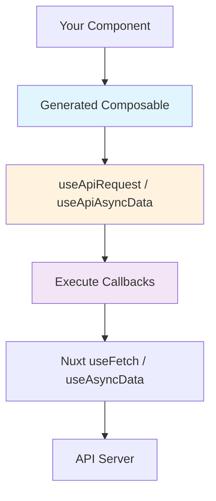

# Composables

The `useFetch` and `useAsyncData` generators create type-safe composables for your Nuxt application. These composables wrap Nuxt's built-in data fetching composables with additional features like lifecycle callbacks, request interception, and global callback support.

## Overview

Generated composables provide:

- ✅ **Type Safety**: Request parameters and responses are fully typed from OpenAPI schemas
- ✅ **SSR Compatible**: Works seamlessly with Nuxt's server-side rendering
- ✅ **Lifecycle Callbacks**: `onRequest`, `onSuccess`, `onError`, `onFinish`
- ✅ **Global Callbacks**: Define callbacks once, apply to all requests
- ✅ **Request Interception**: Modify headers, body, query params before sending
- ✅ **Zero Dependencies**: Only uses Nuxt built-in APIs

## Two Composable Types

### useFetch Composables

Generated when using `--generator useFetch`:

```typescript
const { data, pending, error, refresh } = useFetchGetPets()
```

**Best for:** Simple API calls, basic CRUD operations

[Learn more about useFetch →](/composables/use-fetch/)

### useAsyncData Composables

Generated when using `--generator useAsyncData`:

```typescript
const { data, pending, error, refresh } = useAsyncDataGetPets('pets-key')
```

**Best for:** Complex logic, data transformations, raw responses

[Learn more about useAsyncData →](/composables/use-async-data/)

## Shared Features

Both composable types share the same powerful features:

### Callbacks

Execute code at different stages of the request lifecycle:

```typescript
useFetchGetPet(
  { petId: 123 },
  {
    onRequest: () => console.log('Starting...'),
    onSuccess: (data) => console.log('Success!', data),
    onError: (error) => console.error('Failed!', error),
    onFinish: () => console.log('Done!')
  }
)
```

[Learn more about callbacks →](/composables/features/callbacks/overview)

### Global Callbacks

Define callbacks once in a plugin, apply them everywhere:

```typescript
// plugins/api.ts
useGlobalCallbacks({
  onRequest: ({ headers }) => {
    headers['Authorization'] = `Bearer ${getToken()}`
  }
})
```

[Learn more about global callbacks →](/composables/features/global-callbacks/overview)

### Request Interception

Modify requests before they're sent:

```typescript
useFetchGetUsers({}, {
  onRequest: ({ headers, query }) => {
    headers['X-Custom'] = 'value'
    query.limit = 100
  }
})
```

[Learn more about request interception →](/composables/features/request-interception)

### Data Transformation

Transform response data with `transform` option:

```typescript
useAsyncDataGetPets('pets', {}, {
  transform: (pets) => pets.map(p => ({ ...p, displayName: p.name.toUpperCase() }))
})
```

[Learn more about data transformation →](/composables/features/data-transformation)

### Authentication

Add auth tokens and handle unauthorized responses:

```typescript
useGlobalCallbacks({
  onRequest: ({ headers }) => {
    headers['Authorization'] = `Bearer ${getToken()}`
  },
  onError: (error) => {
    if (error.status === 401) {
      navigateTo('/login')
    }
  }
})
```

[Learn more about authentication →](/composables/features/authentication)

### Error Handling

Centralized error handling with global callbacks:

```typescript
useGlobalCallbacks({
  onError: (error) => {
    if (error.status === 404) {
      showToast('Resource not found', 'error')
    } else if (error.status >= 500) {
      showToast('Server error, please try again', 'error')
    }
  }
})
```

[Learn more about error handling →](/composables/features/error-handling)

## Quick Comparison

| Feature | useFetch | useAsyncData |
|---------|----------|--------------|
| Simplicity | ⭐⭐⭐ | ⭐⭐ |
| Type Safety | ✅ Full | ✅ Full |
| SSR Compatible | ✅ Yes | ✅ Yes |
| Callbacks | ✅ Full | ✅ Full |
| Raw Response | ❌ No | ✅ Yes |
| Data Transform | ✅ Full | ✅ Full |
| Cache Key | Auto | Manual |
| Best For | Simple calls | Complex logic |

## Architecture



1. **Your Component** calls the generated composable
2. **Generated Composable** wraps request with type safety
3. **Runtime Helper** executes callbacks and delegates to Nuxt
4. **Nuxt Composable** makes the actual HTTP request
5. **API Server** responds with data

## Next Steps

- **Learn useFetch**: [useFetch Introduction →](/composables/use-fetch/)
- **Learn useAsyncData**: [useAsyncData Introduction →](/composables/use-async-data/)
- **See Examples**: [Practical Examples →](/examples/composables/basic/simple-get)
- **Explore Features**: [Shared Features →](/composables/features/)
