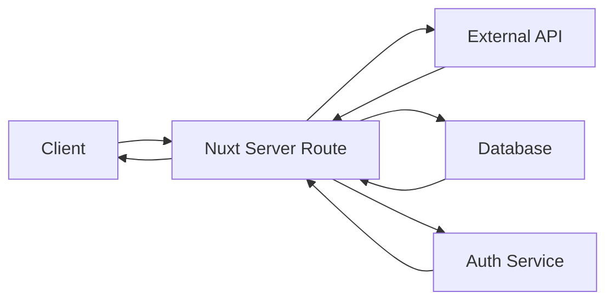
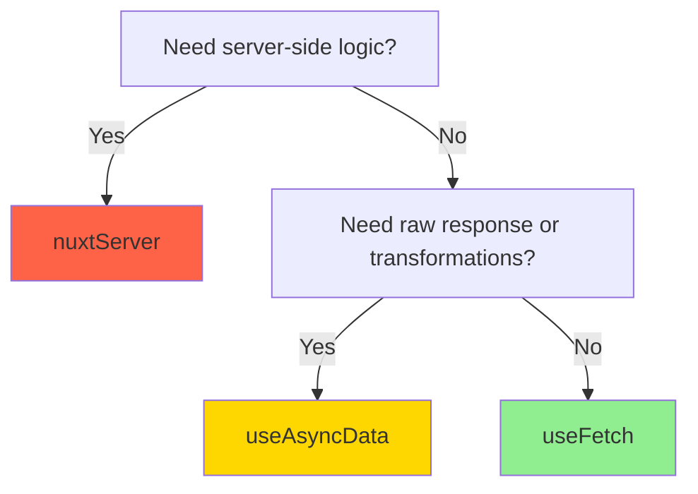

# Choosing a Generator

Nuxt Generator supports three generator types. Each has different use cases, advantages, and trade-offs.

## Quick Comparison

| Feature | useFetch | useAsyncData | nuxtServer |
|---------|----------|--------------|------------|
| **Complexity** | Simple | Medium | Advanced |
| **SSR Compatible** | ✅ Yes | ✅ Yes | ✅ Yes |
| **Type Safety** | ✅ Full | ✅ Full | ✅ Full |
| **Callbacks** | ✅ Full | ✅ Full | ⚠️ Manual |
| **Raw Response** | ❌ No | ✅ Yes | ✅ Yes |
| **Data Transform** | ✅ Full | ✅ Full | ✅ Full |
| **Client Usage** | Simple | Simple | Requires composable |
| **Server Logic** | ❌ No | ❌ No | ✅ Yes |
| **Best For** | Basic CRUD | Complex logic | BFF pattern |

## 1. useFetch Generator

**Recommended for:** 80% of use cases - simple API calls, basic CRUD operations

### What It Generates

```typescript
export function useFetchGetPetById(
  params: { petId: number },
  options?: ApiRequestOptions<Pet>
) {
  return useApiRequest<Pet>('/pets/{petId}', {
    method: 'GET',
    pathParams: params,
    ...options
  })
}
```

### Characteristics

- ✅ Uses Nuxt's `useFetch` under the hood
- ✅ Simple, predictable API
- ✅ Executes immediately on mount
- ✅ Returns reactive refs: `data`, `pending`, `error`, `refresh`
- ❌ No access to raw response (headers, status)
- ✅ Full data transformation with `transform` and `pick`

### Usage Example

```vue
<script setup lang="ts">
const { data: pet, pending, error, refresh } = useFetchGetPetById(
  { petId: 123 },
  {
    onSuccess: (pet) => {
      showToast(`Loaded ${pet.name}`)
    }
  }
)
</script>

<template>
  <div v-if="pending">Loading...</div>
  <div v-else-if="error">Error: {{ error }}</div>
  <div v-else>{{ pet.name }}</div>
</template>
```

### When to Use

✅ **Perfect For:**

- Simple GET requests
- Loading data on component mount
- Basic forms (POST, PUT, DELETE)
- Standard CRUD operations
- When you don't need response headers/status

❌ **Not Ideal For:**

- Complex data transformations
- Multiple API calls in one composable
- Accessing raw response (status code, headers)
- Conditional request execution

### Generation

```bash
nxh generate -i swagger.yaml -o ./composables/api -g useFetch
```

## 2. useAsyncData Generator

**Recommended for:** Complex logic, data transformations, conditional requests

### What It Generates

```typescript
export function useAsyncDataGetPets(
  key: string,
  params?: {},
  options?: ApiAsyncDataOptions<Pet[]>
) {
  return useApiAsyncData<Pet[]>(key, '/pets', {
    method: 'GET',
    ...options
  })
}
```

### Characteristics

- ✅ Uses Nuxt's `useAsyncData` under the hood
- ✅ More control over execution
- ✅ Requires unique cache key
- ✅ Can access raw response
- ✅ Full data transformation support
- ⚠️ Slightly more complex API
- ⚠️ Must manage cache keys manually

### Usage Example

```vue
<script setup lang="ts">
// Basic usage (similar to useFetch)
const { data, pending } = useAsyncDataGetPets('pets-list')

// With transformation
const { data: petNames } = useAsyncDataGetPets(
  'pet-names',
  {},
  {
    transform: (pets) => pets.map(p => p.name)
  }
)

// Access raw response
const { data: petResponse } = useAsyncDataGetPetsRaw('pets-raw')

watch(petResponse, (response) => {
  console.log('Status:', response.status)
  console.log('Headers:', response.headers)
  console.log('Data:', response._data)
})
</script>
```

### When to Use

✅ **Perfect For:**

- Transforming response data
- Multiple API calls in one composable
- Accessing raw response (headers, status code)
- Conditional request execution
- Fine-grained cache control
- Complex data processing

❌ **Not Ideal For:**

- Simple GET requests (useFetch is simpler)
- When you don't need transformations
- Beginners (useFetch is easier to understand)

### Raw Response Variant

`useAsyncData` generator also creates a "raw" variant that returns the raw `$fetch` response:

```typescript
// Generated alongside useAsyncDataGetPets
export function useAsyncDataGetPetsRaw(key: string, params?: {}) {
  return useApiAsyncDataRaw<Pet[]>(key, '/pets', {
    method: 'GET'
  })
}
```

Access full response:

```typescript
const { data: response } = useAsyncDataGetPetsRaw('pets-raw')

response.value?.status      // 200
response.value?.statusText  // "OK"
response.value?.headers     // Headers object
response.value?._data       // Pet[] (actual data)
```

### Generation

```bash
nxh generate -i swagger.yaml -o ./composables/api -g useAsyncData
```

## 3. nuxtServer Generator

**Recommended for:** Backend-For-Frontend (BFF) pattern, server-side logic

### What It Generates

```typescript
// server/api/pets/[petId].get.ts
export default defineEventHandler(async (event) => {
  const petId = getRouterParam(event, 'petId')
  
  // Call external API
  const pet = await $fetch(`https://api.external.com/pets/${petId}`)
  
  // Can add auth context, transform data, etc.
  return pet
})
```

### Characteristics

- ✅ Generates Nuxt server routes (not composables)
- ✅ Runs on your Nuxt server (not directly to external API)
- ✅ Can add authentication context
- ✅ Full data transformation on server
- ✅ Can combine multiple data sources
- ✅ More secure (API keys stay on server)
- ⚠️ Requires manual client-side composable or `useFetch`
- ⚠️ No built-in callbacks (must implement manually)

### Usage Example

**Server Route (Generated):**

```typescript
// server/api/pets/[petId].get.ts
export default defineEventHandler(async (event) => {
  const petId = getRouterParam(event, 'petId')
  
  // Verify JWT (auth context)
  const user = await requireAuth(event)
  
  // Call external API
  const pet = await $fetch(`https://api.external.com/pets/${petId}`)
  
  // Transform data (add permissions)
  return {
    ...pet,
    canEdit: user.role === 'admin',
    canDelete: user.role === 'admin'
  }
})
```

**Client Usage:**

```vue
<script setup lang="ts">
// Use Nuxt's useFetch to call YOUR server route
const { data: pet } = useFetch(`/api/pets/123`)

// pet now includes permissions added on server
</script>

<template>
  <div>
    <h1>{{ pet.name }}</h1>
    <button v-if="pet.canEdit">Edit</button>
    <button v-if="pet.canDelete">Delete</button>
  </div>
</template>
```

### When to Use

✅ **Perfect For:**

- Backend-for-Frontend (BFF) pattern
- Adding authentication context (JWT verification)
- Transforming data on server
- Filtering sensitive fields
- Combining data from multiple sources
- Hiding external API details from client
- Adding permissions/authorization logic

❌ **Not Ideal For:**

- Simple client-side API calls (use useFetch instead)
- When you don't need server-side logic
- Prototyping (more setup required)

### Architecture



### Advanced Features

**1. Auth Context:**

```typescript
// server/api/pets/[petId].get.ts
export default defineEventHandler(async (event) => {
  // Extract and verify JWT
  const user = await getUserFromToken(event)
  
  if (!user) {
    throw createError({ statusCode: 401, message: 'Unauthorized' })
  }
  
  // Use user context
  const pet = await $fetch(`https://api.example.com/pets/${petId}`, {
    headers: {
      'X-User-Id': user.id
    }
  })
  
  return pet
})
```

**2. Transformers:**

```typescript
// server/api/pets/index.get.ts
export default defineEventHandler(async (event) => {
  const user = await getUserFromToken(event)
  
  const pets = await $fetch('https://api.example.com/pets')
  
  // Filter based on permissions
  return pets.map(pet => ({
    id: pet.id,
    name: pet.name,
    // Only include email if user is admin
    ...(user.role === 'admin' && { email: pet.ownerEmail })
  }))
})
```

**3. Combining Sources:**

```typescript
// server/api/pets/[petId]/details.get.ts
export default defineEventHandler(async (event) => {
  const petId = getRouterParam(event, 'petId')
  
  // Call multiple APIs in parallel
  const [pet, owner, appointments] = await Promise.all([
    $fetch(`https://api.example.com/pets/${petId}`),
    $fetch(`https://api.example.com/owners/${petId}`),
    $fetch(`https://api.example.com/appointments?petId=${petId}`)
  ])
  
  // Combine data
  return {
    ...pet,
    owner,
    upcomingAppointments: appointments.filter(a => a.date > Date.now())
  }
})
```

### Generation

```bash
nxh generate -i swagger.yaml -o ./server/api -g nuxtServer
```

## Decision Tree

Use this flowchart to choose the right generator:



### Quick Questions

**Do I need...?**

| Question | If Yes → |
|----------|----------|
| Auth context on server? | **nuxtServer** |
| To combine multiple APIs? | **nuxtServer** |
| To filter sensitive data on server? | **nuxtServer** |
| Response headers/status? | **useAsyncData** |
| Data transformations? | **useAsyncData** |
| Multiple API calls in one composable? | **useAsyncData** |
| Simple GET/POST/PUT/DELETE? | **useFetch** |
| Basic CRUD operations? | **useFetch** |
| Fastest setup? | **useFetch** |

## Mixing Generators

You can use **multiple generators in one project**:

```bash
# Generate client composables with useFetch
nxh generate -i swagger.yaml -o ./composables/api -g useFetch

# Generate server routes with nuxtServer
nxh generate -i swagger.yaml -o ./server/api -g nuxtServer
```

**Example: Complex app architecture**

- `useFetch` for simple CRUD (posts, comments)
- `useAsyncData` for complex data (search with filters, pagination)
- `nuxtServer` for auth-sensitive operations (user profile, payments)

## Next Steps

- **See useFetch Examples**: [Basic Examples](/examples/composables/basic/simple-get)
- **See useAsyncData Examples**: [Advanced Examples](/examples/composables/advanced/authentication-flow)
- **See nuxtServer Examples**: [Server Examples](/examples/server/basic-bff/simple-route)
- **Learn About Callbacks**: [Callback System](/composables/features/callbacks/overview)
