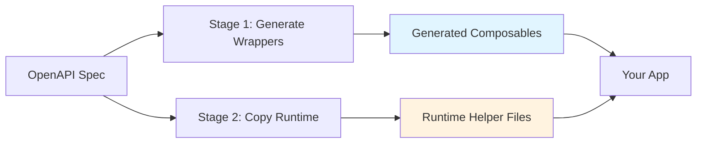
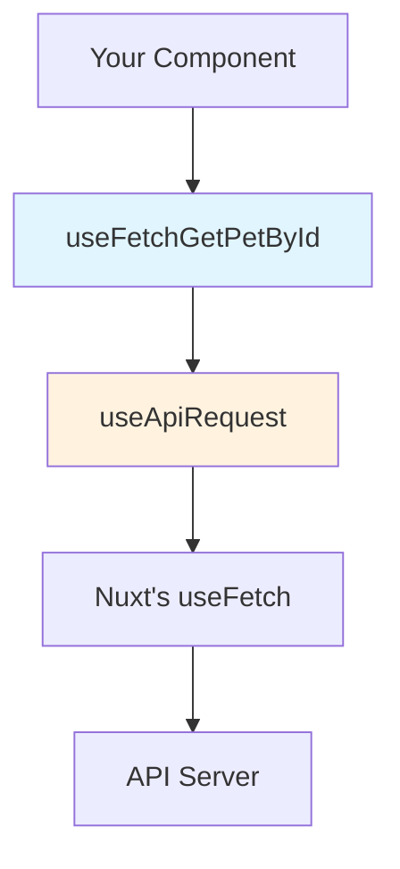
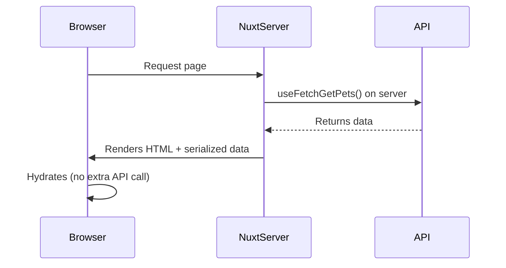
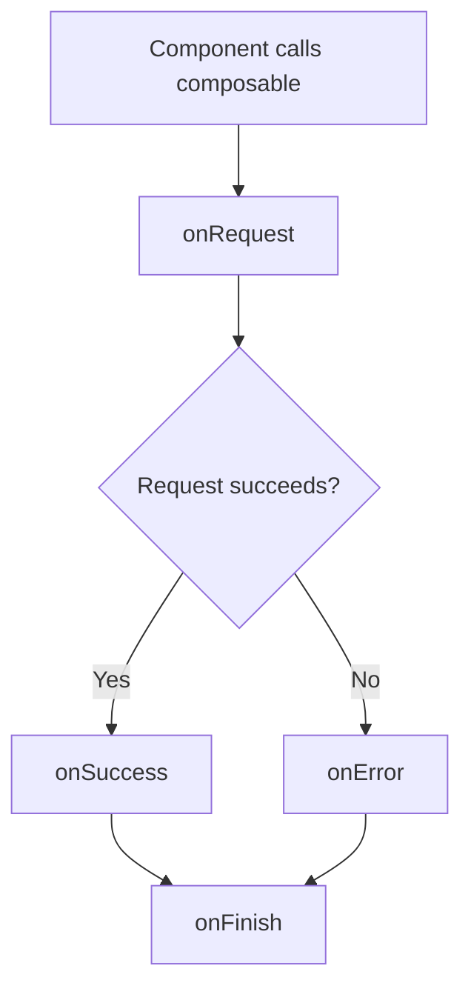

# Core Concepts

Understanding these core concepts will help you use Nuxt OpenAPI Hyperfetch effectively.

## 1. Two-Stage Generation Pattern

Nuxt OpenAPI Hyperfetch follows a **two-stage generation pattern** to keep generated code clean and maintainable:



### Stage 1: Generate Wrappers

Creates **thin wrapper composables** for each API endpoint:

```typescript
// Generated: composables/getPetById.ts
export function useFetchGetPetById(
  params: { petId: number },
  options?: ApiRequestOptions<Pet>
) {
  return useApiRequest<Pet>('/pets/{petId}', {
    method: 'GET',
    pathParams: params,
    ...options
  })
}
```

These are **auto-generated** and should **not be edited manually**. They're regenerated every time you run the generator.

### Stage 2: Copy Runtime Files

Copies **shared helper functions** that all composables depend on:

```typescript
// Copied: runtime/use-api-request.ts
export function useApiRequest<T>(url: string, options: RequestOptions) {
  // Execute callbacks, transform data, handle errors...
}
```

These are **copied once** into your project and **can be edited** if you need custom behavior. Changes persist across regeneration.

**Why This Pattern?**

- ✅ Wrappers stay clean and predictable (easy to regenerate)
- ✅ Runtime logic is customizable (edit without losing changes)
- ✅ No runtime dependency on `nuxt-openapi-hyperfetch` package
- ✅ Full control over implementation details

## 2. Wrapper Pattern

Every generated composable is a **thin wrapper** around Nuxt's built-in composables:



### What Wrappers Do

1. **Extract path parameters**: `{petId}` → replaced with actual value
2. **Add type safety**: Infer request/response types from OpenAPI
3. **Execute callbacks**: Run `onRequest`, `onSuccess`, `onError`, `onFinish`
4. **Delegate to Nuxt**: Use `useFetch` or `useAsyncData` for actual request

### Example Wrapper

```typescript
// Generated wrapper
export function useFetchGetPetById(
  params: { petId: number },     // ← Type-safe params
  options?: ApiRequestOptions<Pet> // ← Type-safe options
) {
  return useApiRequest<Pet>(      // ← Runtime helper
    '/pets/{petId}',               // ← URL template
    {
      method: 'GET',
      pathParams: params,          // ← Extracted from path
      ...options                   // ← User options (callbacks, etc.)
    }
  )
}
```

The wrapper handles **parameter extraction** and **callback execution**, then delegates to `useApiRequest` which calls Nuxt's `useFetch`.

## 3. Generator Types

Nuxt OpenAPI Hyperfetch supports three different generator types, each suitable for different use cases:

### useFetch Generator

**Best for:** Simple API calls, forms, basic CRUD operations

```typescript
// Generated composable
const { data, pending, error, refresh } = useFetchGetPets()
```

**Characteristics:**
- Uses Nuxt's `useFetch` under the hood
- Executes immediately when component mounts
- SSR-compatible (runs on server during SSR)
- Returns reactive refs: `data`, `pending`, `error`

**When to use:**
- ✅ Simple GET requests
- ✅ Loading data on page mount
- ✅ Forms with POST/PUT/DELETE
- ❌ Complex data transformations (use `useAsyncData` instead)

### useAsyncData Generator

**Best for:** Complex logic, data transformations, conditional requests

```typescript
// Generated composable
const { data, pending, error, refresh } = useAsyncDataGetPets(
  'unique-key',
  () => {
    // Custom logic before/after request
    const result = await $fetch('/api/pets')
    return result.map(pet => ({ ...pet, displayName: pet.name.toUpperCase() }))
  }
)
```

**Characteristics:**
- Uses Nuxt's `useAsyncData` under the hood
- Requires a unique cache key
- More control over request execution
- Can return raw `$fetch` response or transformed data

**When to use:**
- ✅ Need to transform response data
- ✅ Multiple API calls in one composable
- ✅ Conditional request execution
- ✅ Access to raw response (headers, status)

### nuxtServer Generator

**Best for:** Backend-for-Frontend (BFF) pattern, server-side logic

```typescript
// Generated server route: server/api/pets/[petId].get.ts
export default defineEventHandler(async (event) => {
  const petId = getRouterParam(event, 'petId')
  
  // Call external API from server
  const pet = await $fetch(`https://api.external.com/pets/${petId}`)
  
  // Transform data on server (add permissions, filter sensitive fields)
  return transformPetWithPermissions(pet, event)
})
```

**Then use from client:**
```typescript
// Client-side usage (no generated composable needed)
const { data: pet } = useFetch(`/api/pets/${petId}`)
```

**Characteristics:**
- Generates Nuxt server routes (not composables)
- Runs on your Nuxt server (not directly to external API)
- Can add auth context, transform data, combine sources
- More secure (API keys stay on server)

**When to use:**
- ✅ Need authentication context (JWT verification)
- ✅ Want to filter/transform data before sending to client
- ✅ Need to combine data from multiple sources
- ✅ Want to hide external API details from client

See [Choosing a Generator](/guide/choosing-a-generator) for detailed comparison.

## 4. Type Safety

All generated composables have **full TypeScript support**:

### Request Parameters

```typescript
// OpenAPI spec defines petId as required integer
useFetchGetPetById({ petId: 123 })  // ✅ Valid

useFetchGetPetById({ petId: "abc" }) // ❌ Type error
useFetchGetPetById({})               // ❌ petId is required
```

### Response Types

```typescript
const { data } = useFetchGetPetById({ petId: 123 })

// TypeScript knows the shape of Pet
data.value?.name      // ✅ string
data.value?.status    // ✅ 'available' | 'pending' | 'sold'
data.value?.unknown   // ❌ Property doesn't exist
```

### Callback Context

```typescript
useFetchGetPetById(
  { petId: 123 },
  {
    onSuccess: (pet) => {
      // 'pet' is typed as Pet
      console.log(pet.name) // ✅ Autocomplete works
    },
    onError: (error) => {
      // 'error' is typed with status, statusText, data
      if (error.status === 404) {
        console.log('Pet not found')
      }
    }
  }
)
```

### Types Are Generated From OpenAPI

All types come directly from your OpenAPI `components/schemas`:

```yaml
# OpenAPI spec
components:
  schemas:
    Pet:
      type: object
      required:
        - id
        - name
      properties:
        id:
          type: integer
        name:
          type: string
        status:
          type: string
          enum: [available, pending, sold]
```

Becomes:

```typescript
// Generated types.d.ts
interface Pet {
  id: number
  name: string
  status: 'available' | 'pending' | 'sold'
}
```

## 5. SSR Compatibility

All generated composables work with Nuxt's **server-side rendering**:



**What this means:**

- ✅ Requests execute on the server during initial page load
- ✅ Data is embedded in HTML (no loading spinner on first render)
- ✅ No duplicate requests (server data is reused on client)
- ✅ Better SEO (content is in HTML)

**Example:**

```vue
<script setup lang="ts">
// This runs on the server during SSR
const { data: pets } = useFetchGetPets()
</script>

<template>
  <!-- Rendered on server, no loading state needed -->
  <ul>
    <li v-for="pet in pets" :key="pet.id">
      {{ pet.name }}
    </li>
  </ul>
</template>
```

## 6. Callbacks

Every composable supports **four lifecycle callbacks**:

```typescript
useFetchGetPetById(
  { petId: 123 },
  {
    onRequest: ({ url, method, headers, body, query }) => {
      // ⏱️ Before request is sent
      // Use to: add headers, log requests, show loading UI
    },
    onSuccess: (data) => {
      // ✅ When response is 2xx
      // Use to: show success toast, navigate, update state
    },
    onError: (error) => {
      // ❌ When response is 4xx/5xx or network error
      // Use to: show error message, retry, log errors
    },
    onFinish: () => {
      // 🏁 Always runs (after success or error)
      // Use to: hide loading spinner, cleanup
    }
  }
)
```

### Execution Order



### Global vs Local Callbacks

**Global Callbacks** (defined once in a plugin):

```typescript
// plugins/api.ts
useGlobalCallbacks({
  onRequest: ({ headers }) => {
    headers['Authorization'] = `Bearer ${getToken()}`
  }
})
```

Applied to **all requests** automatically.

**Local Callbacks** (passed to individual composable):

```typescript
useFetchGetPets({}, {
  onSuccess: (pets) => {
    console.log(`Loaded ${pets.length} pets`)
  }
})
```

Applied to **this request only**.

See [Callbacks](/composables/features/callbacks/overview) for full details.

## 7. Request Interception

Modify requests **before they're sent** using `onRequest`:

```typescript
useFetchGetUsers(
  {},
  {
    onRequest: ({ url, method, headers, body, query }) => {
      // ✅ Modify headers
      headers['X-Custom-Header'] = 'value'
      
      // ✅ Modify query parameters
      query.page = 1
      query.limit = 100
      
      // ✅ Modify body (for POST/PUT)
      if (body) {
        body.timestamp = Date.now()
      }
      
      // ✅ Log for debugging
      console.log(`Making ${method} request to ${url}`)
    }
  }
)
```

**Common Use Cases:**

- Add authentication tokens
- Add correlation IDs for tracing
- Modify query params dynamically
- Log requests for debugging
- Add custom headers

See [Request Interception](/composables/features/request-interception) for more.

## Next Steps

Now that you understand core concepts:

- **Choose a Generator**: Learn about [different generator types](/guide/choosing-a-generator)
- **See Examples**: Browse [practical examples](/examples/composables/basic/simple-get)
- **Add Callbacks**: Learn about [lifecycle callbacks](/composables/features/callbacks/overview)
- **Use Global Callbacks**: Set up [global callbacks](/composables/features/global-callbacks/overview)
