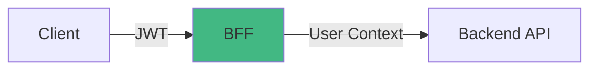

# Passing Context to Backend

Learn how to pass user context and authentication information from your BFF to backend services.

## Overview

When your BFF calls backend APIs, you need to pass authentication and user context:



```typescript
// BFF extracts user
const user = await verifyAuth(event)

// BFF passes context to backend
return $fetch(backend, {
  headers: {
    'X-User-ID': user.id.toString(),
    'X-User-Role': user.role
  }
})
```

## Methods

### 1. HTTP Headers

Most common and flexible method.

#### Basic Headers

```typescript
export default defineEventHandler(async (event) => {
  const user = await verifyAuth(event)
  const config = useRuntimeConfig()
  
  return $fetch(`${config.backendUrl}/pets`, {
    headers: {
      'X-User-ID': user.id.toString(),
      'X-User-Email': user.email,
      'X-User-Role': user.role
    }
  })
})
```

#### Complete Context

```typescript
export default defineEventHandler(async (event) => {
  const user = await verifyAuth(event)
  
  return $fetch(`${config.backendUrl}/pets`, {
    headers: {
      // Identity
      'X-User-ID': user.id.toString(),
      'X-User-Email': user.email,
      
      // Authorization
      'X-User-Role': user.role,
      'X-User-Permissions': user.permissions.join(','),
      
      // Organization
      'X-Tenant-ID': user.tenantId || '',
      'X-Organization-ID': user.organizationId?.toString() || '',
      
      // Request context
      'X-Request-ID': crypto.randomUUID(),
      'X-Client-IP': getRequestIP(event) || ''
    }
  })
})
```

### 2. Query Parameters

Useful for GET requests, but less secure.

```typescript
export default defineEventHandler(async (event) => {
  const user = await verifyAuth(event)
  
  return $fetch(`${config.backendUrl}/pets`, {
    query: {
      userId: user.id,
      role: user.role
    }
  })
})
```

**⚠️ Caution:** Query parameters are:
- Visible in logs
- Cached by CDNs
- Stored in browser history

### 3. Request Body

For POST/PUT/PATCH requests.

```typescript
export default defineEventHandler(async (event) => {
  const user = await verifyAuth(event)
  const body = await readBody(event)
  
  return $fetch(`${config.backendUrl}/pets`, {
    method: 'POST',
    body: {
      ...body,
      // Add user context
      userId: user.id,
      createdBy: user.email
    }
  })
})
```

### 4. JWT Forwarding

Forward original JWT to backend.

```typescript
export default defineEventHandler(async (event) => {
  const user = await verifyAuth(event)
  
  // Get original token
  const token = getCookie(event, 'auth-token')
    || getHeader(event, 'authorization')?.replace('Bearer ', '')
  
  return $fetch(`${config.backendUrl}/pets`, {
    headers: {
      'Authorization': `Bearer ${token}`
    }
  })
})
```

**Benefits:**
- Backend can verify JWT independently
- Backend gets full JWT claims
- Single source of truth

**Drawbacks:**
- Backend needs JWT secret
- Token might expire
- Increased coupling

### 5. Service Token

BFF generates its own token for backend.

```typescript
import jwt from 'jsonwebtoken'

export default defineEventHandler(async (event) => {
  const user = await verifyAuth(event)
  const config = useRuntimeConfig()
  
  // Generate service token
  const serviceToken = jwt.sign(
    {
      userId: user.id,
      email: user.email,
      role: user.role,
      service: 'nuxt-bff'
    },
    config.backendServiceSecret,
    { expiresIn: '5m' }
  )
  
  return $fetch(`${config.backendUrl}/pets`, {
    headers: {
      'Authorization': `Bearer ${serviceToken}`
    }
  })
})
```

**Benefits:**
- Backend-specific token
- Short expiration
- Service identification

## Standard Headers

### Recommended Headers

```typescript
{
  // Identity
  'X-User-ID': string,
  'X-User-Email': string,
  
  // Authorization
  'X-User-Role': string,
  'X-User-Permissions': string,  // comma-separated
  
  // Organization
  'X-Tenant-ID': string,
  'X-Organization-ID': string,
  
  // Tracing
  'X-Request-ID': string,
  'X-Correlation-ID': string,
  
  // Metadata
  'X-Client-IP': string,
  'X-User-Agent': string
}
```

### Header Helper

```typescript
// server/utils/context.ts
export function buildContextHeaders(
  user: AuthUser,
  event: H3Event
): Record<string, string> {
  return {
    'X-User-ID': user.id.toString(),
    'X-User-Email': user.email,
    'X-User-Role': user.role,
    'X-User-Permissions': user.permissions.join(','),
    'X-Tenant-ID': user.tenantId || '',
    'X-Request-ID': crypto.randomUUID(),
    'X-Client-IP': getRequestIP(event) || '',
    'X-User-Agent': getHeader(event, 'user-agent') || ''
  }
}

// Usage
export default defineEventHandler(async (event) => {
  const user = await verifyAuth(event)
  
  return $fetch(`${config.backendUrl}/pets`, {
    headers: buildContextHeaders(user, event)
  })
})
```

## API Key + User Context

Combine API key (for service auth) with user context.

```typescript
export default defineEventHandler(async (event) => {
  const user = await verifyAuth(event)
  const config = useRuntimeConfig()
  
  return $fetch(`${config.backendUrl}/pets`, {
    headers: {
      // Service authentication
      'X-API-Key': config.backendApiKey,
      
      // User context
      'X-User-ID': user.id.toString(),
      'X-User-Role': user.role
    }
  })
})
```

**Pattern:**
- API Key: Authenticates the BFF service
- User Headers: Provides user context

## Multi-Tenant Context

```typescript
export default defineEventHandler(async (event) => {
  const user = await verifyAuth(event)
  
  // Verify tenant access
  const tenantId = getRouterParam(event, 'tenantId')
  if (tenantId && tenantId !== user.tenantId) {
    throw createError({ statusCode: 403 })
  }
  
  return $fetch(`${config.backendUrl}/pets`, {
    headers: {
      'X-User-ID': user.id.toString(),
      'X-Tenant-ID': user.tenantId,
      'X-API-Key': config.backendApiKey
    }
  })
})
```

## Request Tracing

Add correlation IDs for distributed tracing.

```typescript
export default defineEventHandler(async (event) => {
  const user = await verifyAuth(event)
  
  // Generate or propagate trace ID
  const traceId = getHeader(event, 'x-trace-id') 
    || crypto.randomUUID()
  
  const requestId = crypto.randomUUID()
  
  return $fetch(`${config.backendUrl}/pets`, {
    headers: {
      'X-User-ID': user.id.toString(),
      'X-Trace-ID': traceId,
      'X-Request-ID': requestId,
      'X-Span-ID': crypto.randomUUID()
    }
  })
})
```

## Backend Implementation

### Backend Reads Context

```typescript
// Backend API (Express example)
app.get('/pets', async (req, res) => {
  // Extract user context from headers
  const userId = parseInt(req.headers['x-user-id'])
  const userRole = req.headers['x-user-role']
  const tenantId = req.headers['x-tenant-id']
  
  // Use context in query
  const pets = await db.pets.find({
    tenantId,
    ...(userRole !== 'admin' && { ownerId: userId })
  })
  
  res.json(pets)
})
```

### Backend Middleware

```typescript
// Backend middleware
app.use((req, res, next) => {
  // Attach user context to request
  req.user = {
    id: parseInt(req.headers['x-user-id']),
    email: req.headers['x-user-email'],
    role: req.headers['x-user-role'],
    permissions: req.headers['x-user-permissions']?.split(',') || []
  }
  
  next()
})

// Use in routes
app.get('/pets', async (req, res) => {
  const pets = await fetchPetsForUser(req.user.id)
  res.json(pets)
})
```

## Security Considerations

### Verify API Key

Backend should verify the request comes from trusted BFF:

```typescript
// Backend
app.use((req, res, next) => {
  const apiKey = req.headers['x-api-key']
  
  if (apiKey !== process.env.EXPECTED_API_KEY) {
    return res.status(401).json({ error: 'Unauthorized' })
  }
  
  next()
})
```

### Don't Trust User Headers Publicly

User context headers should ONLY be trusted from BFF:

```typescript
// ❌ BAD: Anyone can send X-User-ID header
app.get('/pets', (req, res) => {
  const userId = req.headers['x-user-id']  // Spoofable!
  // ...
})

// ✅ GOOD: Verify API key first
app.use((req, res, next) => {
  if (req.headers['x-api-key'] !== SECRET_KEY) {
    return res.status(401).end()
  }
  next()
})
```

### Network Isolation

Deploy BFF and backend in private network:

```
┌─────────────────────────────────┐
│  Internet                        │
│                                  │
│  ┌──────────┐                   │
│  │  Client  │                   │
│  └────┬─────┘                   │
│       │                          │
└───────┼──────────────────────────┘
        │ HTTPS (public)
┌───────┼──────────────────────────┐
│       ↓                          │
│  ┌──────────┐                   │
│  │   BFF    │                   │
│  └────┬─────┘                   │
│       │ Internal network         │
│       │ (not publicly accessible)│
│       ↓                          │
│  ┌──────────┐                   │
│  │ Backend  │                   │
│  └──────────┘                   │
│                                  │
│  Private Network                 │
└──────────────────────────────────┘
```

## Complete Example

```typescript
// server/utils/backend-client.ts
export async function callBackend<T>(
  path: string,
  event: H3Event,
  options: RequestInit = {}
): Promise<T> {
  const user = await verifyAuth(event)
  const config = useRuntimeConfig()
  const requestId = crypto.randomUUID()
  
  // Log outgoing request
  console.log({
    requestId,
    userId: user.id,
    path,
    method: options.method || 'GET'
  })
  
  try {
    const response = await $fetch<T>(`${config.backendUrl}${path}`, {
      ...options,
      headers: {
        ...options.headers,
        // Service auth
        'X-API-Key': config.backendApiKey,
        // User context
        'X-User-ID': user.id.toString(),
        'X-User-Email': user.email,
        'X-User-Role': user.role,
        'X-Tenant-ID': user.tenantId || '',
        // Tracing
        'X-Request-ID': requestId,
        'X-Client-IP': getRequestIP(event) || ''
      }
    })
    
    return response
  } catch (error) {
    console.error({
      requestId,
      error: error.message
    })
    throw error
  }
}

// Usage
export default defineEventHandler(async (event) => {
  return callBackend('/pets', event)
})
```

## Best Practices

### ✅ Do

```typescript
// ✅ Use standard header names
headers: { 'X-User-ID': user.id }

// ✅ Add request tracing
headers: { 'X-Request-ID': crypto.randomUUID() }

// ✅ Verify API key on backend
if (apiKey !== EXPECTED_KEY) throw error

// ✅ Use helper functions
return callBackend('/pets', event)
```

### ❌ Don't

```typescript
// ❌ Don't expose backend URL to client
const pets = await $fetch(publicBackendUrl)

// ❌ Don't trust headers from public requests
const userId = req.headers['x-user-id']  // Without API key verification

// ❌ Don't send sensitive data in headers
headers: { 'X-Password': user.password }

// ❌ Don't use query params for sensitive context
query: { userId, apiKey }  // Visible in logs!
```

## Next Steps

- [Data Transformers →](/server/transformers/)
- [Route Structure →](/server/route-structure)
- [Examples →](/examples/server/auth-patterns/)
