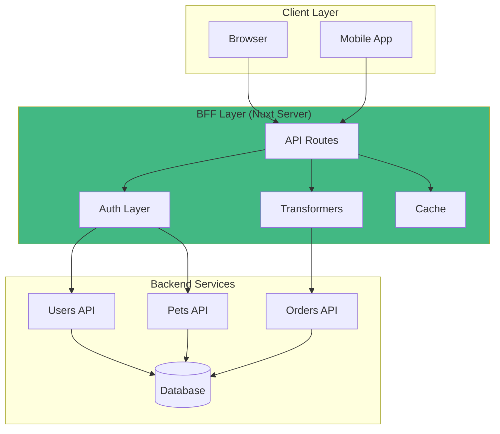
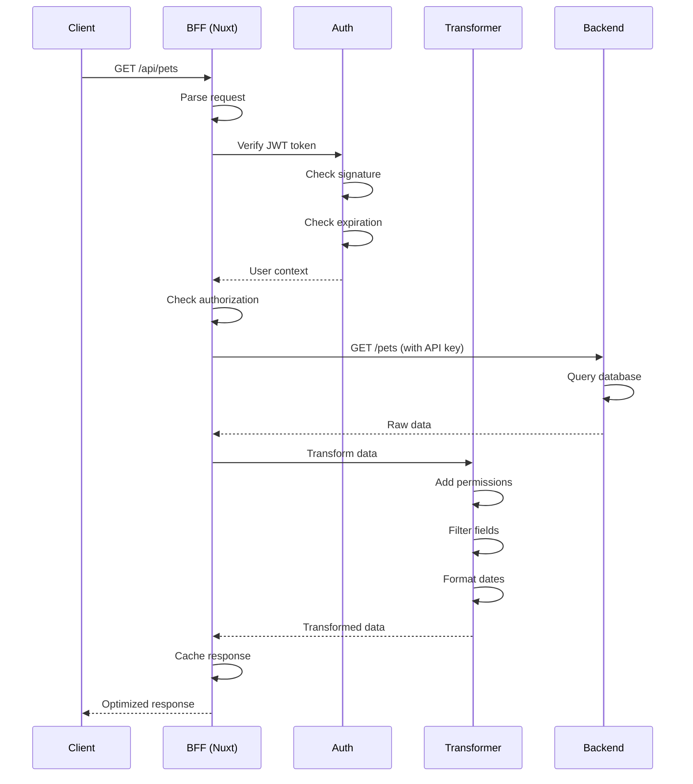
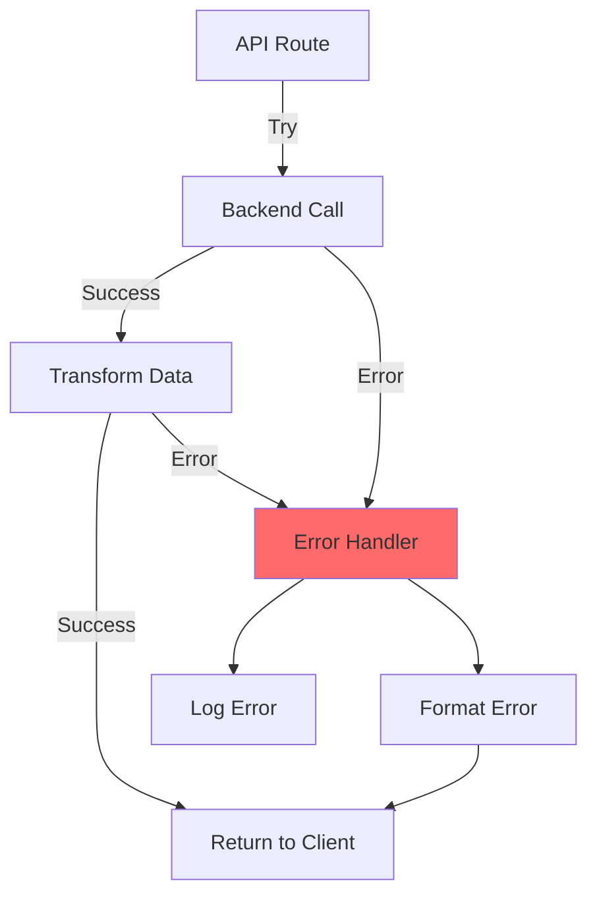
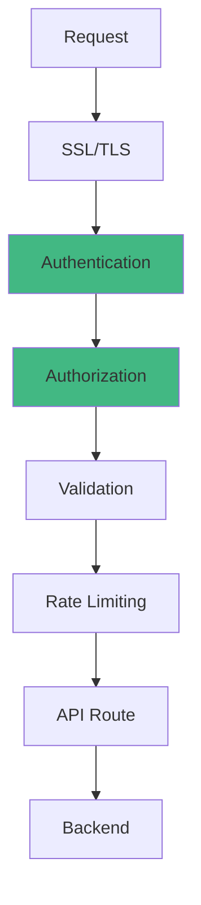
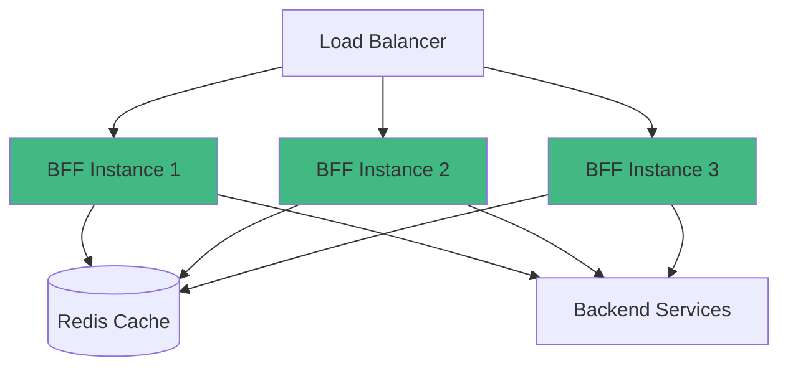

# BFF Architecture

Understanding the architectural components and data flow of the Backend for Frontend pattern.

## System Architecture



## Layers

### 1. Client Layer

**Responsibility:** User interface and experience

```vue
<script setup>
// Simple, declarative data fetching
const { data: pets } = await useFetch('/api/pets')
</script>

<template>
  <PetList :pets="pets" />
</template>
```

**Key Points:**
- No direct backend access
- No API key management
- No complex auth logic
- Simplified data structures

### 2. BFF Layer (Nuxt Server)

**Responsibility:** Frontend-specific API gateway

```typescript
// server/api/pets/index.get.ts
export default defineEventHandler(async (event) => {
  // 1. Authentication
  const user = await verifyAuth(event)
  
  // 2. Authorization
  if (!user.hasPermission('pets.read')) {
    throw createError({ statusCode: 403 })
  }
  
  // 3. Backend call
  const pets = await fetchPetsFromBackend()
  
  // 4. Transformation
  return transformPetsForUser(pets, user)
})
```

**Components:**
- API Routes
- Authentication/Authorization
- Data transformation
- Caching
- Error handling
- Request validation

### 3. Backend Layer

**Responsibility:** Business logic and data persistence

```typescript
// External backend service
GET https://api.backend.com/pets
→ Returns raw business data
```

**Key Points:**
- Generic, reusable APIs
- Business logic
- Data persistence
- May serve multiple BFFs

## Request Flow

### Detailed Flow



### 1. Client Request

```typescript
// Client makes request
const response = await $fetch('/api/pets', {
  credentials: 'include'  // Sends auth cookies
})
```

### 2. BFF Receives Request

```typescript
// server/api/pets/index.get.ts
export default defineEventHandler(async (event) => {
  // Parse headers, cookies, query params
  const query = getQuery(event)
  const cookies = parseCookies(event)
})
```

### 3. Authentication

```typescript
// Verify JWT from cookie or header
const token = getCookie(event, 'auth-token')
const user = jwt.verify(token, config.jwtSecret)
```

### 4. Authorization

```typescript
// Check permissions
if (!user.permissions.includes('pets.read')) {
  throw createError({
    statusCode: 403,
    message: 'Forbidden'
  })
}
```

### 5. Backend Call

```typescript
// Call backend with server credentials
const pets = await $fetch(`${config.backendUrl}/pets`, {
  headers: {
    'X-API-Key': config.backendApiKey,
    'X-User-ID': user.id
  },
  query
})
```

### 6. Data Transformation

```typescript
// Transform for frontend
const transformed = pets.map(pet => ({
  id: pet.id,
  name: pet.name,
  canEdit: pet.ownerId === user.id,
  canDelete: user.role === 'admin'
}))
```

### 7. Response

```typescript
// Return to client
return transformed
```

## Component Architecture

### API Routes Structure

```
server/
└── api/
    ├── auth/
    │   ├── login.post.ts
    │   └── logout.post.ts
    ├── pets/
    │   ├── index.get.ts      ← GET /api/pets
    │   ├── index.post.ts     ← POST /api/pets
    │   └── [id]/
    │       ├── index.get.ts  ← GET /api/pets/:id
    │       ├── index.put.ts  ← PUT /api/pets/:id
    │       └── index.delete.ts ← DELETE /api/pets/:id
    └── orders/
        └── ...
```

### Utilities Structure

```
server/
└── utils/
    ├── auth.ts           ← Authentication helpers
    ├── transformers.ts   ← Data transformers
    ├── api-client.ts     ← Backend API client
    └── cache.ts          ← Caching utilities
```

### Middleware Structure

```
server/
└── middleware/
    ├── auth.ts           ← Global auth middleware
    ├── cors.ts           ← CORS configuration
    ├── error-handler.ts  ← Error handling
    └── logger.ts         ← Request logging
```

## Data Flow Patterns

### Pattern 1: Simple Proxy

```typescript
// Minimal transformation
export default defineEventHandler(async (event) => {
  const user = await verifyAuth(event)
  
  return $fetch(`${config.backendUrl}/pets`, {
    headers: {
      'X-User-ID': user.id,
      'X-API-Key': config.backendApiKey
    }
  })
})
```

### Pattern 2: Data Aggregation

```typescript
// Combine multiple sources
export default defineEventHandler(async (event) => {
  const user = await verifyAuth(event)
  
  const [pets, favorites, stats] = await Promise.all([
    $fetch(`${config.backendUrl}/pets`),
    $fetch(`${config.backendUrl}/favorites/${user.id}`),
    $fetch(`${config.backendUrl}/stats`)
  ])
  
  return {
    pets,
    favorites: new Set(favorites.map(f => f.petId)),
    stats
  }
})
```

### Pattern 3: Enrichment

```typescript
// Add user-specific data
export default defineEventHandler(async (event) => {
  const user = await verifyAuth(event)
  const pets = await fetchFromBackend()
  
  return pets.map(pet => ({
    ...pet,
    isFavorite: user.favorites.includes(pet.id),
    canEdit: pet.ownerId === user.id,
    canDelete: user.role === 'admin'
  }))
})
```

### Pattern 4: Filtering

```typescript
// Filter based on user permissions
export default defineEventHandler(async (event) => {
  const user = await verifyAuth(event)
  const pets = await fetchFromBackend()
  
  // Admin sees all, users see only their own
  if (user.role === 'admin') {
    return pets
  }
  
  return pets.filter(pet => pet.ownerId === user.id)
})
```

## Caching Architecture

### Multi-Level Cache


### Implementation

```typescript
// server/utils/cache.ts
const cache = new Map()

export async function getCached<T>(
  key: string,
  fetcher: () => Promise<T>,
  ttl: number = 60000
): Promise<T> {
  const cached = cache.get(key)
  
  if (cached && Date.now() - cached.time < ttl) {
    return cached.data
  }
  
  const data = await fetcher()
  cache.set(key, { data, time: Date.now() })
  
  return data
}
```

```typescript
// Usage in route
export default defineEventHandler(async (event) => {
  return getCached('pets', async () => {
    return $fetch(`${config.backendUrl}/pets`)
  }, 30000)  // 30 second TTL
})
```

## Error Handling Architecture

### Error Flow



### Implementation

```typescript
// server/middleware/error-handler.ts
export default defineEventHandler(async (event) => {
  try {
    await handler(event)
  } catch (error) {
    // Log error
    console.error('API Error:', error)
    
    // Send to monitoring
    await logToMonitoring(error)
    
    // Return user-friendly message
    throw createError({
      statusCode: error.statusCode || 500,
      message: error.message || 'Internal server error'
    })
  }
})
```

## Security Architecture

### Security Layers



### Defense in Depth

```typescript
// 1. SSL/TLS (Nuxt/hosting handles)

// 2. Authentication
const user = await verifyAuth(event)

// 3. Authorization
if (!user.hasPermission('pets.write')) {
  throw createError({ statusCode: 403 })
}

// 4. Input validation
const body = await readBody(event)
const validated = await validateSchema(body, petSchema)

// 5. Rate limiting
await checkRateLimit(user.id)

// 6. Backend call with credentials
return $fetch(backend, {
  headers: { 'X-API-Key': config.apiKey }
})
```

## Scalability

### Horizontal Scaling



### Stateless Design

```typescript
// ✅ Stateless (can scale horizontally)
export default defineEventHandler(async (event) => {
  // Get state from cookie/header
  const user = await verifyAuth(event)
  
  // No server memory needed
  return fetchData(user.id)
})

// ❌ Stateful (hard to scale)
let userSessions = {}  // In-memory state

export default defineEventHandler(async (event) => {
  // Tied to this server instance
  userSessions[userId] = data
})
```

## Next Steps

- [BFF Benefits →](/server/bff-pattern/benefits)
- [Implementation Guide →](/server/getting-started)
- [Auth Context →](/server/auth-context/)
- [Data Transformers →](/server/transformers/)
