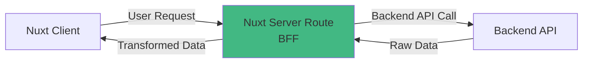
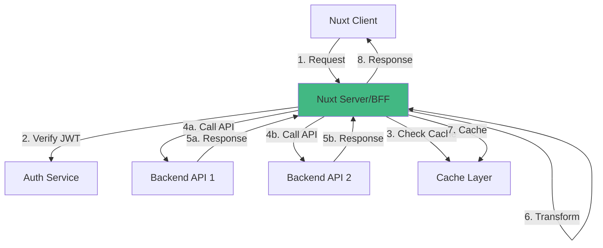

# Backend for Frontend (BFF) Pattern

The BFF pattern is an architectural approach where you create a dedicated backend specifically tailored for your frontend application.

## Overview

Instead of calling backend APIs directly from the client, you create an intermediate API layer on your Nuxt server that:

1. Receives requests from frontend
2. Authenticates and authorizes users
3. Calls backend services
4. Transforms and aggregates data
5. Returns optimized responses



## Why BFF?

### Traditional Approach (No BFF)

```typescript
// ❌ Client calls backend directly
// Problems:
// - API keys exposed
// - CORS configuration needed
// - No data transformation
// - No user context
const { data } = await $fetch('https://backend.com/api/pets', {
  headers: {
    'X-API-Key': 'exposed-in-client-code'  // 🚨 Security risk!
  }
})
```

### BFF Approach

```typescript
// ✅ Client calls your server
// Benefits:
// - API keys hidden
// - No CORS issues
// - Server-side transformation
// - User context available
const { data } = await $fetch('/api/pets')
// Your server handles backend communication
```

## Core Concepts

### 1. Single API Gateway

Your Nuxt server acts as a gateway:

```typescript
// server/api/pets/index.get.ts
export default defineEventHandler(async (event) => {
  const config = useRuntimeConfig()
  
  // Backend call with hidden credentials
  return $fetch(`${config.backendUrl}/pets`, {
    headers: {
      'X-API-Key': config.backendApiKey  // ✅ Server-only
    }
  })
})
```

### 2. Authentication Layer

Add user authentication automatically:

```typescript
export default defineEventHandler(async (event) => {
  // Verify user JWT
  const user = await verifyAuth(event)
  
  // Call backend with user context
  return $fetch(`${config.backendUrl}/pets`, {
    headers: {
      'X-User-ID': user.id
    }
  })
})
```

### 3. Data Transformation

Transform data before sending to client:

```typescript
export default defineEventHandler(async (event) => {
  const user = await verifyAuth(event)
  const pets = await fetchPetsFromBackend()
  
  // Add user-specific flags
  return pets.map(pet => ({
    ...pet,
    canEdit: pet.ownerId === user.id,
    canDelete: user.role === 'admin' || pet.ownerId === user.id
  }))
})
```

### 4. Aggregation

Combine multiple API calls:

```typescript
export default defineEventHandler(async (event) => {
  // Fetch from multiple sources in parallel
  const [pets, owners, stats] = await Promise.all([
    $fetch(`${config.backendUrl}/pets`),
    $fetch(`${config.backendUrl}/owners`),
    $fetch(`${config.backendUrl}/stats`)
  ])
  
  // Combine data
  return {
    pets: pets.map(pet => ({
      ...pet,
      owner: owners.find(o => o.id === pet.ownerId)
    })),
    totalPets: stats.totalPets,
    availablePets: stats.available
  }
})
```

## Benefits

### 🔒 Enhanced Security

```typescript
// API keys stay on server
const config = useRuntimeConfig()
const response = await $fetch(config.backendUrl, {
  headers: {
    'X-API-Key': config.backendApiKey  // Never exposed to client
  }
})
```

### 🚀 Better Performance

```typescript
// Reduce data transferred to client
return pets.map(pet => ({
  id: pet.id,
  name: pet.name,
  status: pet.status
  // Remove: internal_metadata, audit_logs, etc.
}))
```

### 🎯 Simplified Client

```vue
<script setup>
// Clean, simple client code
const { data: pets } = await useFetch('/api/pets')
// No auth handling, no CORS, no API key management
</script>
```

### 🔧 Flexible Backend Integration

```typescript
// Change backend without touching client
export default defineEventHandler(async (event) => {
  if (process.env.USE_NEW_API === 'true') {
    return fetchFromNewBackend()
  }
  return fetchFromOldBackend()
})
```

## Real-World Example

### Without BFF

```vue
<script setup>
// ❌ Complex client code
const config = useRuntimeConfig()
const authToken = useCookie('auth-token')
const apiKey = config.public.apiKey  // Exposed!

const { data: pets } = await $fetch('https://backend.com/api/pets', {
  headers: {
    'Authorization': `Bearer ${authToken.value}`,
    'X-API-Key': apiKey  // 🚨 Security risk
  }
})

// Transform data on client (slower)
const enrichedPets = computed(() => 
  pets.value?.map(pet => ({
    ...pet,
    canEdit: pet.ownerId === userStore.id
  }))
)
</script>
```

### With BFF

```vue
<script setup>
// ✅ Simple, clean client code
const { data: pets } = await useFetch('/api/pets')
// Server handles: auth, backend calls, transformations
</script>
```

```typescript
// server/api/pets/index.get.ts
export default defineEventHandler(async (event) => {
  const config = useRuntimeConfig()
  const user = await verifyAuth(event)
  
  // Backend call with hidden credentials
  const pets = await $fetch(`${config.backendUrl}/pets`, {
    headers: {
      'X-API-Key': config.backendApiKey,
      'X-User-ID': user.id
    }
  })
  
  // Transform on server (faster)
  return pets.map(pet => ({
    ...pet,
    canEdit: pet.ownerId === user.id,
    canDelete: user.role === 'admin'
  }))
})
```

## When to Use BFF

### ✅ Use BFF When

- Backend requires sensitive credentials
- Need to aggregate data from multiple sources
- Want to add user-specific transformations
- Backend API has different structure than needed
- Implementing authentication/authorization
- Need to cache responses server-side
- Want to hide backend implementation details

### ⚠️ Skip BFF When

- Backend is already public and optimized
- Real-time updates (WebSockets) are primary
- Very simple, read-only data
- Extreme performance requirements (direct CDN access)

## Common Patterns

### API Gateway

```typescript
// All client requests go through server
/api/pets → server routes → backend API
/api/orders → server routes → backend API
/api/users → server routes → backend API
```

### Authentication Proxy

```typescript
// Server verifies user, adds context
Client JWT → Server verification → Backend request with user ID
```

### Data Aggregator

```typescript
// Combine multiple backend calls
GET /api/dashboard →
  - GET /pets
  - GET /orders
  - GET /stats
  → Combined response
```

### Response Transformer

```typescript
// Optimize data structure for frontend
Backend format → Transform on server → Frontend format
```

## Architecture Diagram



## Next Steps

- [What is BFF? →](/server/bff-pattern/what-is-bff)
- [Architecture Details →](/server/bff-pattern/architecture)
- [Benefits Deep Dive →](/server/bff-pattern/benefits)
- [Implementation Guide →](/server/getting-started)
