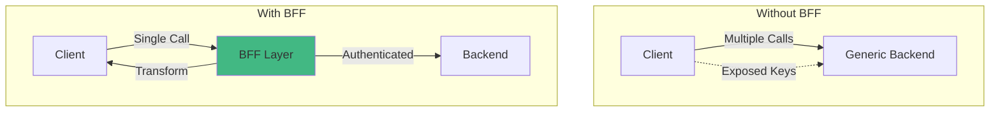
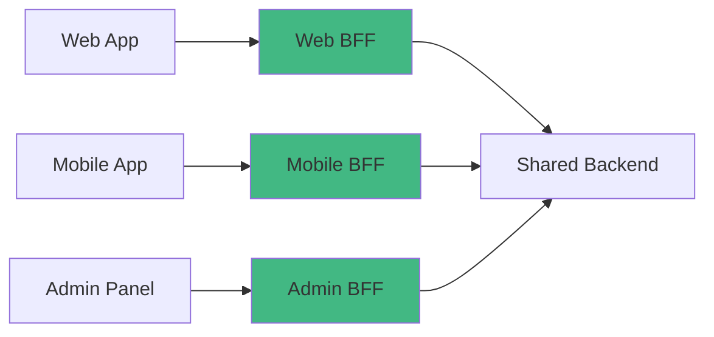

# What is Backend for Frontend (BFF)?

Backend for Frontend (BFF) is an architectural pattern where you create a dedicated backend service specifically designed to serve the needs of a particular frontend application.

## The Problem

Modern applications often face these challenges:

### 1. Generic Backend APIs

```typescript
// Backend API returns EVERYTHING
{
  "id": 1,
  "name": "Fluffy",
  "status": "available",
  "category": { ... },
  "tags": [ ... ],
  "internal_metadata": { ... },  // Not needed by frontend
  "audit_log": [ ... ],          // Not needed by frontend
  "database_timestamps": { ... } // Not needed by frontend
}
```

**Problems:**
- Large payloads (slow network)
- Client must filter/transform
- Exposes internal data
- Different frontends need different data

### 2. Security Concerns

```typescript
// ❌ Client makes direct API calls
const pets = await $fetch('https://api.backend.com/pets', {
  headers: {
    'X-API-Key': 'sk_live_abc123'  // 🚨 Exposed in browser!
  }
})
```

**Problems:**
- API keys exposed in client code
- CORS configuration required
- No server-side validation
- Backend endpoints visible to everyone

### 3. Multiple API Calls

```typescript
// ❌ Client makes 3 separate requests
const pets = await $fetch('/api/pets')
const owners = await $fetch('/api/owners')
const categories = await $fetch('/api/categories')

// Client combines data (slow)
const enrichedPets = pets.map(pet => ({
  ...pet,
  owner: owners.find(o => o.id === pet.ownerId),
  category: categories.find(c => c.id === pet.categoryId)
}))
```

**Problems:**
- Multiple network round trips
- Waterfall loading
- Complex client logic
- Higher latency

## The Solution: BFF

Create an intermediate server layer that:

1. **Sits between frontend and backend**
2. **Tailored for frontend needs**
3. **Handles security and logic**



### Example Implementation

#### Backend API (Generic)

```json
// GET https://api.backend.com/pets/1
{
  "id": 1,
  "name": "Fluffy",
  "species": "cat",
  "breed": "Persian",
  "age": 3,
  "status": "available",
  "owner_id": 456,
  "created_at": "2024-01-15T10:30:00Z",
  "updated_at": "2024-03-20T14:20:00Z",
  "internal_status_code": "AVL_001",
  "inventory_location": "Warehouse B",
  "supplier_id": 789,
  "cost_price": 500,
  "sell_price": 800,
  "metadata": { ... }
}
```

#### BFF Layer (Tailored)

```typescript
// server/api/pets/[id]/index.get.ts
export default defineEventHandler(async (event) => {
  const id = getRouterParam(event, 'id')
  const user = await verifyAuth(event)
  const config = useRuntimeConfig()
  
  // Call backend with API key (hidden from client)
  const pet = await $fetch(`${config.backendUrl}/pets/${id}`, {
    headers: {
      'X-API-Key': config.backendApiKey
    }
  })
  
  // Return only what frontend needs
  return {
    id: pet.id,
    name: pet.name,
    species: pet.species,
    age: pet.age,
    status: pet.status,
    // Add user-specific fields
    canEdit: pet.owner_id === user.id,
    canDelete: user.role === 'admin',
    isOwner: pet.owner_id === user.id
  }
})
```

#### Client (Simple)

```vue
<script setup>
// ✅ Simple, clean call
const { id } = useRoute().params
const { data: pet } = await useFetch(`/api/pets/${id}`)

// All logic handled by BFF!
</script>

<template>
  <div>
    <h1>{{ pet.name }}</h1>
    <p>{{ pet.species }}, {{ pet.age }} years old</p>
    
    <button v-if="pet.canEdit">Edit</button>
    <button v-if="pet.canDelete">Delete</button>
  </div>
</template>
```

## Key Characteristics

### 1. Frontend-Specific

Each frontend gets its own BFF:



**Why?**
- Web needs rich data for desktop
- Mobile needs minimal data for bandwidth
- Admin needs detailed data for management

### 2. Backend Aggregation

```typescript
// BFF combines multiple backend calls
export default defineEventHandler(async (event) => {
  // Parallel requests
  const [pet, owner, medicalRecords] = await Promise.all([
    $fetch(`${config.backendUrl}/pets/1`),
    $fetch(`${config.backendUrl}/owners/456`),
    $fetch(`${config.backendUrl}/medical-records?petId=1`)
  ])
  
  // Single response
  return {
    pet,
    owner: {
      name: owner.name,
      phone: owner.phone
    },
    hasVaccinations: medicalRecords.length > 0
  }
})
```

### 3. Security Gateway

```typescript
export default defineEventHandler(async (event) => {
  // 1. Authenticate user
  const user = await verifyAuth(event)
  
  // 2. Authorize action
  if (user.role !== 'admin') {
    throw createError({
      statusCode: 403,
      message: 'Admin access required'
    })
  }
  
  // 3. Call backend with server credentials
  return $fetch(`${config.backendUrl}/admin/data`, {
    headers: {
      'X-API-Key': config.backendApiKey  // Hidden from client
    }
  })
})
```

### 4. Data Transformation

```typescript
export default defineEventHandler(async (event) => {
  const pets = await fetchFromBackend()
  
  // Transform for frontend needs
  return pets.map(pet => ({
    id: pet.id,
    displayName: `${pet.name} (${pet.species})`,
    statusLabel: pet.status === 'available' ? 'Available' : 'Unavailable',
    ageGroup: pet.age < 1 ? 'Puppy' : 'Adult',
    imageUrl: pet.photos[0] || '/default-pet.png'
  }))
})
```

## BFF in Nuxt

Nuxt is **perfect** for BFF because:

### 1. Server Routes Built-in

```
server/
└── api/
    └── pets/
        └── index.get.ts  ← Your BFF!
```

### 2. Type-Safe Client Calls

```typescript
// TypeScript knows the return type automatically
const { data } = await useFetch('/api/pets')
//     ^? Ref<Pet[]>
```

### 3. Same Codebase

```typescript
// Share types between server and client
// types/Pet.ts
export interface Pet {
  id: number
  name: string
}

// server/api/pets/index.get.ts
export default defineEventHandler(async (): Promise<Pet[]> => {
  // ...
})

// pages/pets.vue
const { data } = await useFetch<Pet[]>('/api/pets')
```

### 4. SSR-Friendly

```vue
<script setup>
// Runs on server during SSR
const { data } = await useFetch('/api/pets')
// Server → BFF → Backend → BFF → Server → Client
// No client-side API calls during initial load!
</script>
```

## Comparison

| Aspect | Direct Backend | With BFF |
|--------|---------------|----------|
| **API Keys** | Exposed in client | Hidden on server |
| **CORS** | Required | Not needed |
| **Data Size** | All backend data | Only what's needed |
| **API Calls** | Multiple from client | Single to BFF |
| **Auth** | Client handles | Server handles |
| **Transformation** | Client-side (slow) | Server-side (fast) |
| **Backend Changes** | Update client code | Update BFF only |
| **Security** | Lower | Higher |

## Real-World Analogy

Think of BFF like a **waiter** in a restaurant:

### Without BFF
```
You → Walk to kitchen → Ask chef for ingredients →
     Transport ingredients → Cook at your table
```
**Problems:** Slow, complex, you see the kitchen mess

### With BFF (Waiter)
```
You → Tell waiter what you want → Waiter handles kitchen →
     Waiter brings finished dish
```
**Benefits:** Fast, simple, you get exactly what you need

## Common Misconceptions

### ❌ "BFF is just another API"

**Wrong.** BFF is **tailored** for your specific frontend:

```typescript
// Generic API (one size fits all)
GET /api/users
→ Returns: { id, name, email, role, permissions[], ... }

// BFF (optimized for mobile app)
GET /api/mobile/user
→ Returns: { id, name, avatar }  // Minimal data

// BFF (optimized for admin panel)
GET /api/admin/user
→ Returns: { id, name, email, role, lastLogin, logs[], ... }
```

### ❌ "BFF adds latency"

**Wrong.** BFF often **reduces** latency:

```typescript
// Without BFF: 3 round trips
const pets = await $fetch('/pets')      // 200ms
const owners = await $fetch('/owners')  // 200ms
const categories = await $fetch('/categories')  // 200ms
// Total: 600ms + client-side processing

// With BFF: 1 round trip
const data = await $fetch('/api/pets-with-details')
// Server does 3 calls in parallel: ~200ms
// Total: ~200ms (3x faster!)
```

### ❌ "BFF is overkill for small apps"

**Partially true.** But even small apps benefit from:
- Hidden API keys
- Simplified client code
- No CORS issues
- Easy to add features later

## Next Steps

- [BFF Architecture →](/server/bff-pattern/architecture)
- [BFF Benefits →](/server/bff-pattern/benefits)
- [Implementation Guide →](/server/getting-started)
- [Examples →](/examples/server/basic-bff/)
