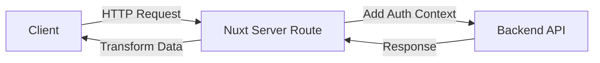
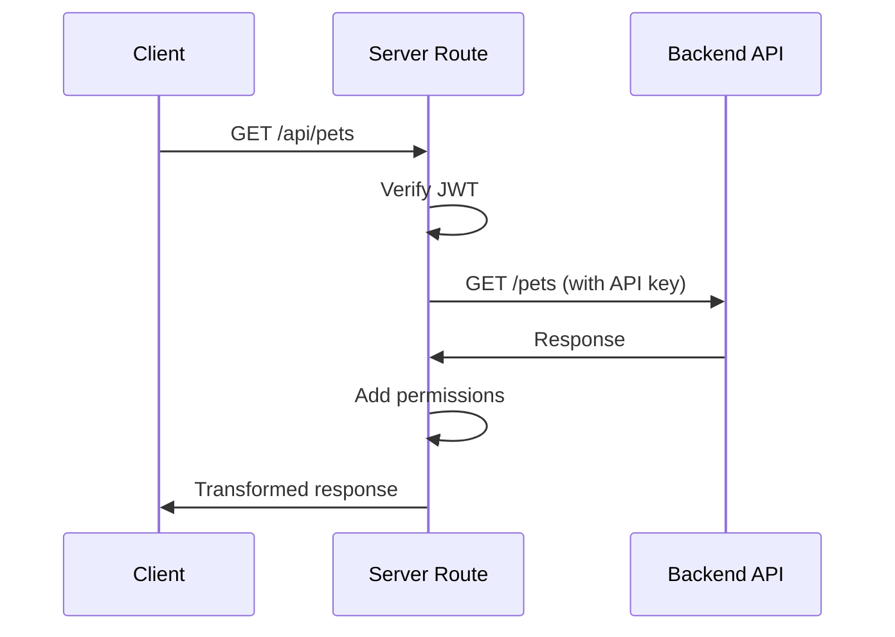

# Server Routes

Server routes in nuxt-openapi-hyperfetch implement the **Backend for Frontend (BFF)** pattern, providing a secure API layer between your Nuxt frontend and backend services.

## Overview

When generating with the `nuxtServer` generator, you get:

- **Server API Routes** - Nuxt server endpoints in `/server/api/`
- **Authentication Context** - Automatic JWT verification and user context
- **Data Transformers** - Transform responses before sending to client
- **Type Safety** - Full TypeScript support

```bash
# Generate server routes
nxh generate -g nuxtServer
```

## Architecture



## Key Benefits

### 🔒 Security

- Hide backend API endpoints from client
- Add authentication/authorization layer
- Sanitize sensitive data
- Rate limiting and validation

### 🎯 Simplified Client

- No auth token management on client
- No CORS issues
- Single API endpoint
- Cleaner composables

### 🚀 Performance

- Data transformation on server (faster)
- Response caching
- Request deduplication
- Reduced payload size

### 🔧 Flexibility

- Add custom business logic
- Combine multiple API calls
- Transform data structures
- Environment-specific behavior

## Quick Example

### Generated Server Route

```typescript
// server/api/pets/index.get.ts
export default defineEventHandler(async (event) => {
  const config = useRuntimeConfig()
  
  // Verify user authentication
  const user = await verifyAuth(event)
  
  // Call backend API
  const pets = await $fetch(`${config.backendUrl}/pets`, {
    headers: {
      Authorization: `Bearer ${config.backendApiKey}`
    }
  })
  
  // Transform response
  return transformPetsResponse(pets, user)
})
```

### Client Usage

```typescript
// Client composable (automatically generated)
const { data: pets } = useFetchGetPets()

// Calls: /api/pets (your server)
// NOT: https://backend.example.com/pets (direct backend call)
```

## What's Generated

### File Structure

```
server/
├── api/
│   ├── pets/
│   │   ├── index.get.ts        # GET /api/pets
│   │   ├── index.post.ts       # POST /api/pets
│   │   └── [id]/
│   │       ├── index.get.ts    # GET /api/pets/:id
│   │       ├── index.put.ts    # PUT /api/pets/:id
│   │       └── index.delete.ts # DELETE /api/pets/:id
│   └── orders/
│       └── ...
├── utils/
│   ├── auth.ts                 # Auth helpers
│   └── transformers.ts         # Data transformers
└── middleware/
    └── auth.ts                 # Auth middleware
```

### Generated Components

1. **API Routes** - One file per endpoint
2. **Auth Context** - JWT verification utilities
3. **Transformers** - Data transformation functions
4. **Type Definitions** - Shared TypeScript interfaces

## When to Use Server Routes

### ✅ Use Server Routes When

- Backend API requires sensitive credentials
- Need to add user-specific data transformations
- Want to hide backend implementation from client
- Need to combine multiple API calls
- Implementing authentication/authorization
- Want to cache responses server-side

### ⚠️ Use Direct Client Calls When

- Public API with no sensitive data
- Real-time updates (WebSockets)
- File uploads/downloads (better client-direct)
- Static data fetching

## Comparison

| Feature | Client Direct | Server Routes (BFF) |
|---------|--------------|---------------------|
| **Security** | Client has API keys | Keys stay on server |
| **CORS** | May need CORS config | No CORS issues |
| **Auth** | Manual token handling | Automatic context |
| **Data Transform** | Client-side (slower) | Server-side (faster) |
| **Caching** | Browser cache only | Server + browser cache |
| **Flexibility** | Limited | Full control |
| **Complexity** | Simpler | More setup |

## Configuration

### Runtime Config

```typescript
// nuxt.config.ts
export default defineNuxtConfig({
  runtimeConfig: {
    // Private (server-only)
    backendUrl: process.env.BACKEND_URL,
    backendApiKey: process.env.BACKEND_API_KEY,
    jwtSecret: process.env.JWT_SECRET,
    
    public: {
      // Public (client + server)
      apiBase: '/api'
    }
  }
})
```

### Environment Variables

```bash
# .env
BACKEND_URL=https://api.example.com
BACKEND_API_KEY=secret-key-here
JWT_SECRET=your-jwt-secret
```

## Common Patterns

### Authentication Flow



### Data Transformation

```typescript
// Before (from backend)
{
  "id": 1,
  "name": "Fluffy",
  "owner_id": 123,
  "internal_status": "available_for_sale"
}

// After (from server route)
{
  "id": 1,
  "name": "Fluffy",
  "canEdit": true,      // Based on user permissions
  "canDelete": false,   // Based on user permissions
  "isOwner": false      // Checked against user ID
}
```

## Features

### Built-in

- ✅ JWT verification
- ✅ User context extraction
- ✅ Error handling
- ✅ Request validation
- ✅ Response transformation
- ✅ TypeScript support

### Optional

- Rate limiting (add middleware)
- Request caching (add caching layer)
- Logging (add logger)
- Monitoring (add APM)

## Next Steps

<div class="next-steps">

**Getting Started**
- [Setup Guide →](/server/getting-started)
- [Route Structure →](/server/route-structure)

**Learn BFF Pattern**
- [What is BFF? →](/server/bff-pattern/what-is-bff)
- [Architecture →](/server/bff-pattern/architecture)
- [Benefits →](/server/bff-pattern/benefits)

**Implementation**
- [Auth Context →](/server/auth-context/)
- [Data Transformers →](/server/transformers/)
- [Examples →](/examples/server/basic-bff/)

</div>

## Resources

- [Nuxt Server Routes](https://nuxt.com/docs/guide/directory-structure/server)
- [BFF Pattern](https://samnewman.io/patterns/architectural/bff/)
- [JWT Best Practices](https://tools.ietf.org/html/rfc8725)
